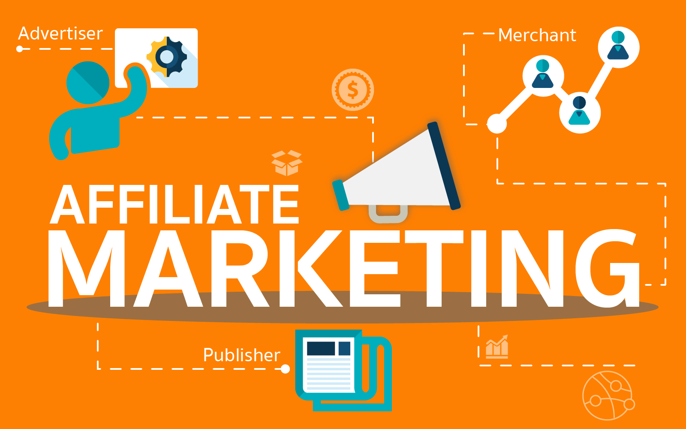
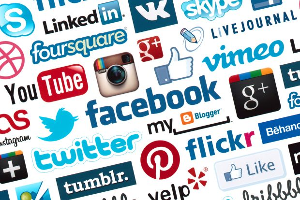
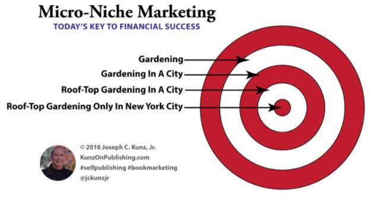
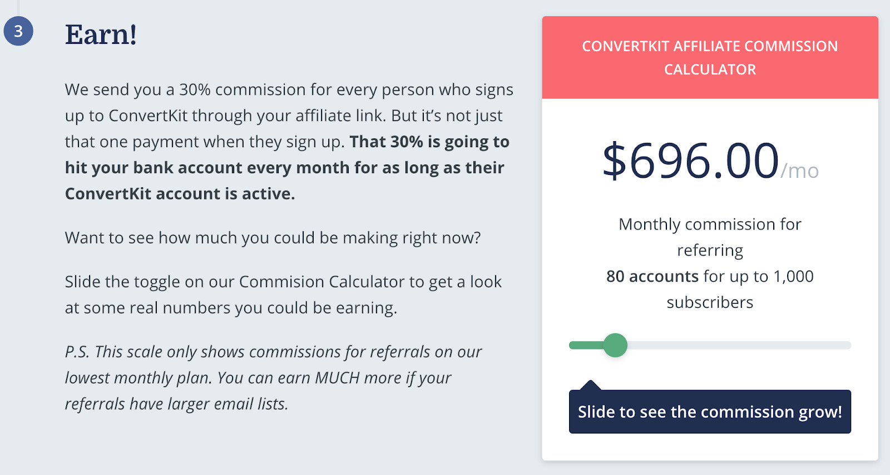
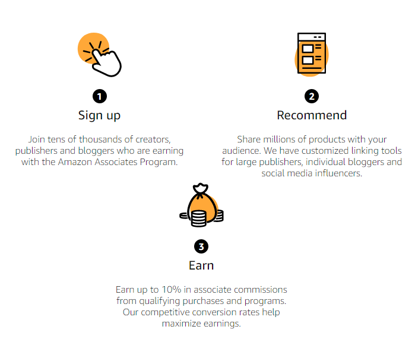
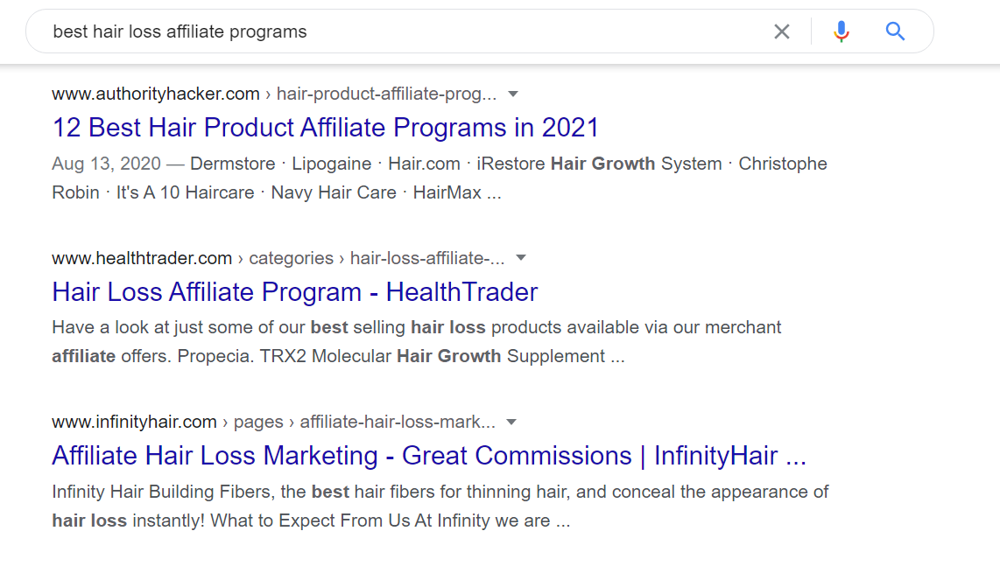
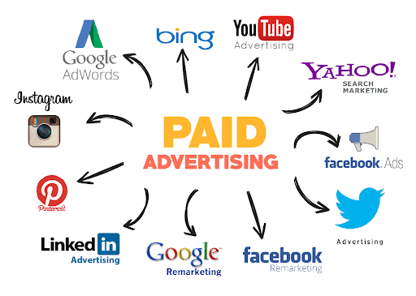
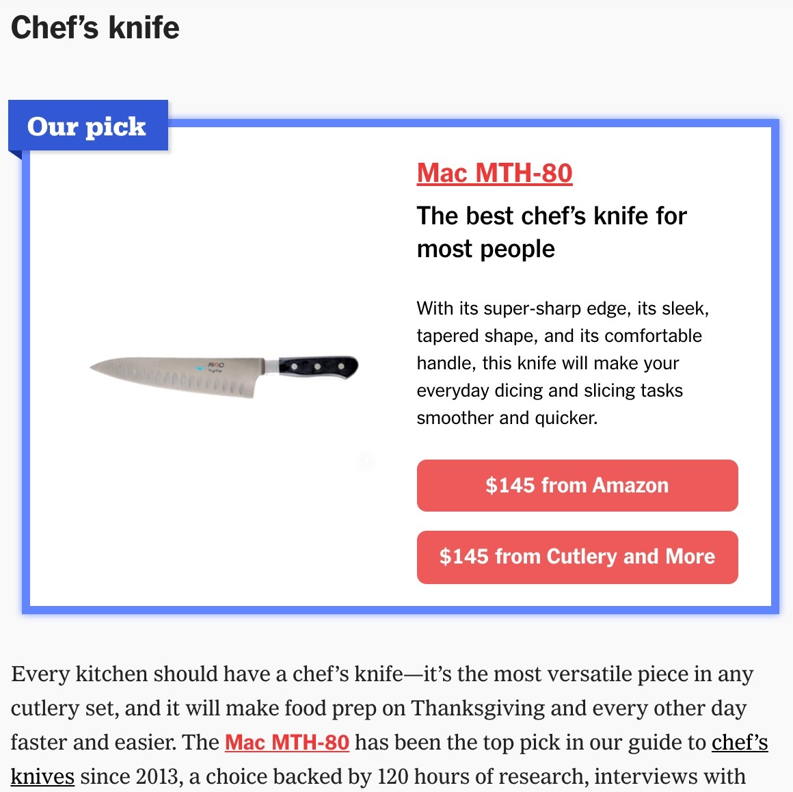
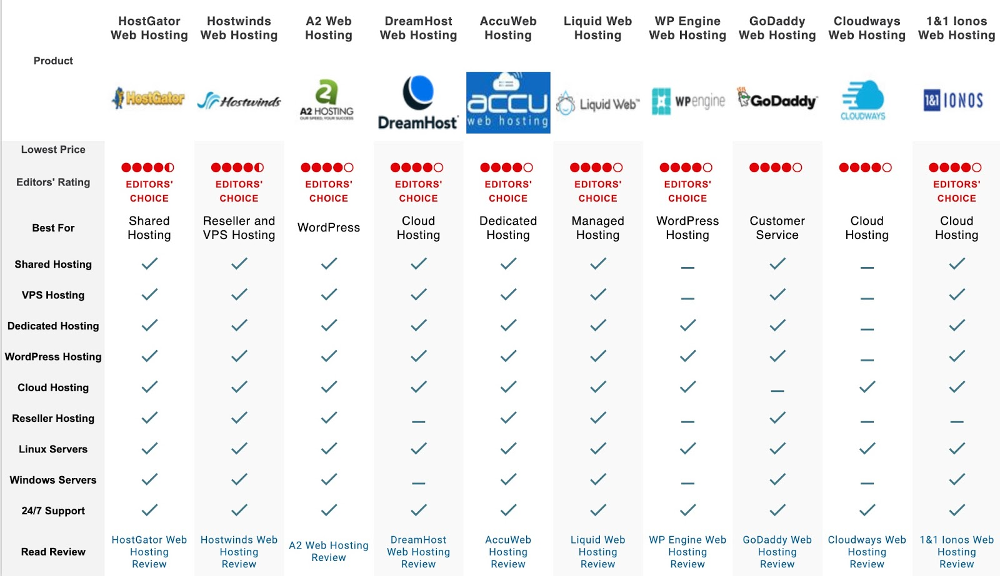
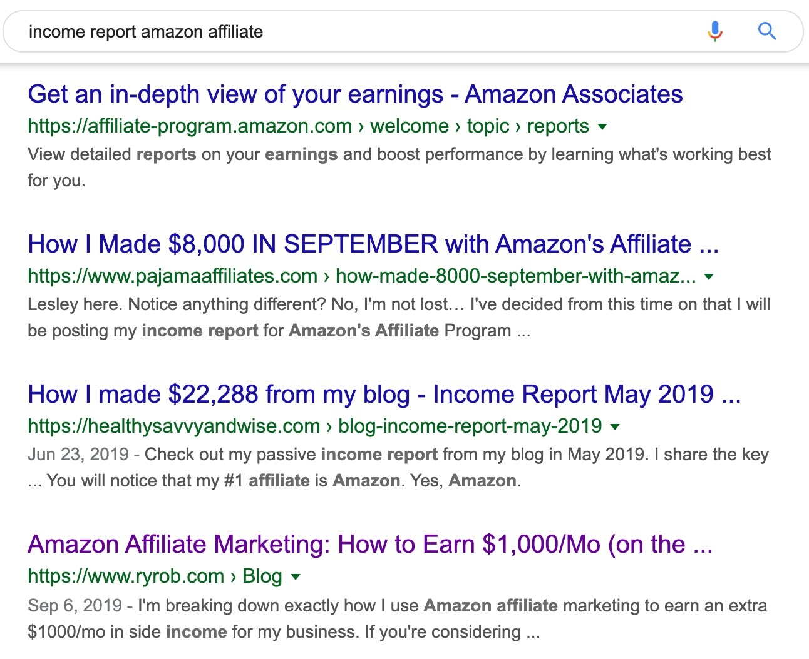

Affiliate marketing is one way of making money by advertising products or services of others.

You promote other companies’ products. When someone buys through your affiliate link, you get a commission.

If it is a digital product. You get paid when they subscribe. or download a copy.

You will not be paid if you do not make a conversion -sale, subscribe ...

## Example Of Affiliate Marketing

When you are watching a YouTube video and you like the product the presenter is using. you think of buying one similar so you check the video description and you find a link to Amazon. you buy it. and they get a small commission.

That is affiliate marketing process in a nutshell. nothing more.

## How to start Affiliate Marketing

According to [Statista](https://www.statista.com/statistics/693438/affiliate-marketing-spending/), business spending on affiliate marketing will hit $8.2 billion in the U.S by 2022.

Start today, and you’ll be in a prime position to take advantage of that.

In this guide, you’ll learn how to get started with affiliate marketing.

Follow these simple steps.

- Pick a platform
- Pick a niche
- Find affiliate programs
- Create original Content
- Drive traffic to your site
- Get clicks on your affiliate links
- Convert clicks to sales

## Step 1: Pick a platform

Theoretically, you can do affiliate marketing on any platform. Even TikTok works.

Most instagram pages are doing either Affiliate Marketing or eCommerce.

However, it’s much easier to build an audience and increase your affiliate sales via one of two channels: a blog or YouTube channel.

Because not everyone can grow an audience on Instagram or TikTok. there is a lot of competition.

Starting a blog today is easy and cheap. There are plenty of tutorials online that teach you how to get started. The best part? It’ll likely only cost you a few dollars per month.

The second best platform is YouTube. Creating and uploading content to YouTube is free, which makes it ideal for many people. Optimize your videos for SEO, and include affiliate links in your description.

Now, you’ll likely get more clicks from a blog than a YouTube video. For that reason, most of the examples going forward will be for a blog.

## Step 2: Pick a niche

If you were doing this in 2004. picking a topic like Nutrition would be okay. there is not much competition online. But it's 2021 And the number of bloggers in the U.S is around 32 million.

So if you write about "Tea for weight loss" you have better chance to rank and beat the competition. unlike a blog about general weight loss tips that will be hard to rank.

Instead of "Beauty" write about "Skin Care At Home". this will narrow down your audience and decrease the competition.

This is called: Niche Down. AKA Sub-niche AKA micro-niche.

Choose a topic that focuses on a <strong> specific category</strong>.

A specific category<strong> That you are passionate about</strong>

> This is the most important Step. Take your time and think it through.

Many affiliate sites die due to a lack of consistency. So at the very least, if you’re passionate about a topic, you’ll find it much easier to press on when the going gets tough.

## Step 3: Find affiliate programs

Now that you have picked your sub-niche. Finding affiliate programs is easy.

There are three types of affiliate programs to choose from.

- ### High-paying, low-volume affiliate programs

These are affiliate programs for niche products with high payouts.

For example: if you send just 80 customers to ConvertKit’s affiliate program.
They will pay you almost $700.

However, as they sell CRM software for small business owners, there’s a limited pool of buyers.

There also tends to be more competition for programs with high commissions.

> Conclusion: Since you're a beginner. t’ll be quite challenging to make a meaningful amount of money competing against skilled marketers with deep pockets.

- ### Low-paying, high-volume affiliate programs

These are affiliate programs for products with low payouts but mass appeal.

Take, for example, PS5 games. While many people play PS5, the average cost of a game is about $65, and affiliate commissions are usually in the single digits. This means that if you're lucky, you'll make $4–6 per sale.

The redeeming aspect of these services is that they typically have a wide range of items to sell. Take, for example, Amazon's affiliate program. For almost all Amazon sells, you can receive up to 10% commission.

> Due to the low payout. To make these types of affiliate programs pay, you’ll need lots of traffic. which may be challenging on Free traffic only.

- ### High-paying, high-volume affiliate programs

These are affiliate programs for products with mass appeal, which also pay high commissions.

One example is credit cards.

Everyone requires a credit card, and the majority of customers remain with the company for years (if not decades!)

The disadvantage of these items is that they draw affiliate marketers with a lot of experience and a lot of money. Some often use spammy strategies in which you would be unable to contend.

- ### Conclusion: How to decide which affiliate programs to join

This depends on your niche and level of expertise.

If you’re targeting consumers, you’ll likely go with the second model of low commissions and higher sales volume.

If you’re going after a business audience (softwares mostly), you’ll likely go for the first model: high-paying and low volume.

The best way to find these affiliate programs is with a Google search.

However, if there is a product you’d really like to promote without a public affiliate program, reach out to the company and ask if they would be willing to build an affiliate relationship with you.

## Step 4: Create great content

If you want your affiliate site to succeed, you need to create high-quality content where your affiliate links fit naturally.

And this can only be done if you are passionate about the product and you would recommend it to friends even if you are not getting paid for it.

Your content should not be a copy paste. it must have an original touch to it.

Here’s an example. Tim Ferriss [interviewed 100+](https://tim.blog/2017/11/18/under100/) famous people and asked them this question:

> What purchase of $100 or less has most positively impacted your life in the last six months (or in recent memory)?

He published the answers in a blog post and included affiliate links to the products mentioned.

His fans loved it. Judging by the comments they bought same products. and he got commissions for every single sale

You may not have access to famous people in the world. neither did this guy on TikTok. But he came up with a different crazy idea.

> [Viral TikTok Star Asks Supercar Owners the Big Question: What Do You Do for a Living?](https://www.thedrive.com/news/37511/viral-tiktok-star-asks-supercar-owners-the-big-question-what-do-you-do-for-a-living)

This is what you have to emulate when creating content for your affiliate site.

Don’t just blindly curate products from Amazon’s best sellers. Go the extra mile to make sure your content solves the visitor’s problem.

And you Would recommend it even if you were not getting paid for it !

## Step 5: Drive traffic to your affiliate site

You’ve created great content. The next step is to get more people to read it, so they will click on your affiliate links.

The three traffic strategies to consider are:

- ### Paid traffic - Advertising

This is where you pay for traffic to your site. You can do this using PPC (Pay Per Click) ads.

The advantage of paid traffic is that the moment you start paying, you get traffic.

However, there are some downsides.

- First, running ads will dig into your profits. It’s quite normal for advertisers to lose money before they make it… if they ever do.

- Secondly, once you stop paying for ads, your traffic will stop.

Generally speaking, ads are a great traffic strategy if you’re part of a high-paying affiliate program and can make the numbers work.

However, if you're new to paid marketing and don't have a marketing budget (or are using lower commission programs like Amazon Associates), it may not be the best idea to start with.

- ### Search engine optimization (SEO)

SEO is the practice of optimizing pages to rank high in search engines like Google.

For as long as you can rank high in the search engines for your target keywords, you’ll get consistent and passive traffic. (free traffic)

On the most basic level, SEO is about:

- Understanding what your target customers are searching for.
- Creating content around those topics (blog posts, product pages, YouTube videos ...).
- Sub-niche works better. Search Engines will bring your page first

The downside of SEO is time. it takes 4 to 6 months to start seeing results. but bear in mind this is when you <strong> start seeing results </strong>, and SEO results grow over time.

Whatever results you're getting at 6 months should be considerably less than what you're getting at 12 months.

- ### Build an email list

Email lists allow you to communicate with your readers directly ! this is important.

Use them to tell readers/fans about new content and keep them coming back to your site for more. This leads to more affiliate clicks and sales.

To build an email list, you need to persuade the readers on your site to sign up. That means offering something valuable.

We prompt the user for email after a small period of time. so we know we are building a list of people interested in making money online. not accidental visitors.

I hope you did subscribe when we prompted you. if not you can still do it at the bottom of the page to stay informed.

## Step 6: Get clicks on your affiliate links

Just because you have an amazing piece of content doesn’t mean people will click on your affiliate links.

There are a few things you need to consider.

- ### A. Link placement

If all your affiliate links are at the bottom of the page where people rarely scroll, clicks will be few and far between.

On the other hand, make every other word a link in your introduction, and your content will look spammy.

Do not rush your reader nor delay it too much. build some trust first. present your offer. then show it.

- ### B. Context

Let’s say you were writing an article on the best kitchen knives for under $50.

Your introduction probably shouldn’t look like this:

> Today, I’m [reviewing](#) the [best](#) chef [knives](#).

The links look out of context and spammy. and you just want to sell.

This would make more sense:

> Today, I’m reviewing three different chef knives you can buy on Amazon for under $50. These are, [item 1](#), [item 2](#), and [item 3](#)

- ### C. Callouts AKA Call-To-Action (CTA)

You have been clicking on CTAs your entire time on the internet.

Using callouts like buttons, tables, and boxes can help attract your readers’ attention and make the post more skimmable.

For example, the Wirecutter uses eye-catching boxes with product links anytime they share a top pick.

PC Mag takes a different approach and uses a comparison table with buttons:

> Once you start driving traffic to your website you will spend a great amount of time testing call to actions and location. and find which one works best for you.

## Step 7: Convert clicks to sales

In affiliate marketing, two conversions need to take place for you to make money.

The first conversion is the <strong>click to the product page</strong>.

You’re 100% in control of this action. Use the tactics above to improve your chances of getting that click.

The second conversion is the <strong>visitor purchasing the product</strong>. In the case of affiliate marketing, the merchant controls the checkout, and their conversion rates are out of your control.

The trick is to play the game to your advantage and look for merchants with programs that convert well.

- ## A. Public income reports

If people are making decent money from an affiliate program, then it’s likely that the product converts well.

How do you know if people are making money?

Look at public income reports where bloggers publicly reveal how much money they’re making from their affiliate deals.

You can find these reports on Google.

For example, if you search for “income report amazon affiliate”, you’ll see a few blog posts showing how bloggers have made money from Amazon Affiliates.

Looks like one blogger made $7,300 in a single month from Amazon commissions. This is a highly converting product.

You have full control over your funnel. since the merchant is converting well.

- ## B. Ask questions

Sign up for an affiliate program and ask questions if there isn't much information available about it.

You may want to know their overall conversion rates or a rough estimate of their top earners' monthly commissions, for example.

- ## C. Use your intuition

Sometimes, it’s best to go with your gut feeling.

If the program or product you’re checking out feels “off,” or if you would personally never recommend the product to a friend or family member, then don’t promote it.

## Final thoughts

No affiliate marketing wheels were reinvented here. These are the basics, and mastering them will set you up for success.

Just don’t expect life-changing income or the freedom to quit your 9–5 overnight. Affiliate marketing takes time.

Focus first on making your first affiliate sale. As your site grows, set new goals, and continue experimenting.

This is how to build up a site that eventually generates a passive income.

I hope i covered all aspects of earning money as an affiliate marketer. if there's something i missed or you still need clearance on. do mention in the comments please.

Affiliate marketing is a good way to get started with online marketing.

The only question is, When will you start ?

Let me know in the comments.
