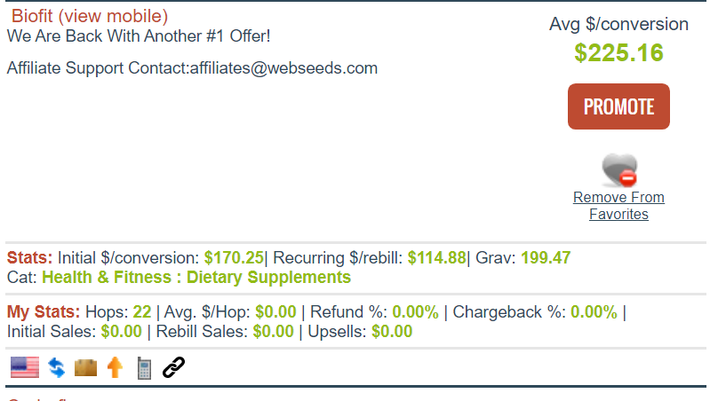
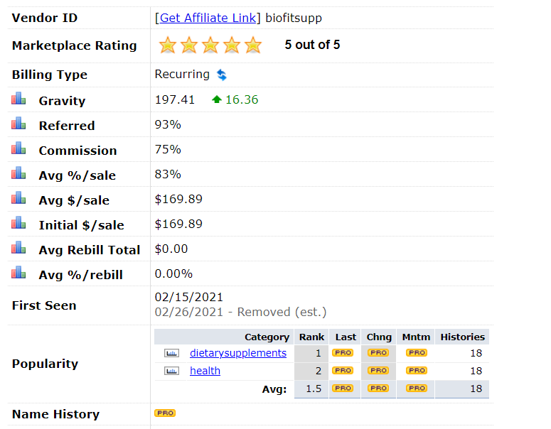
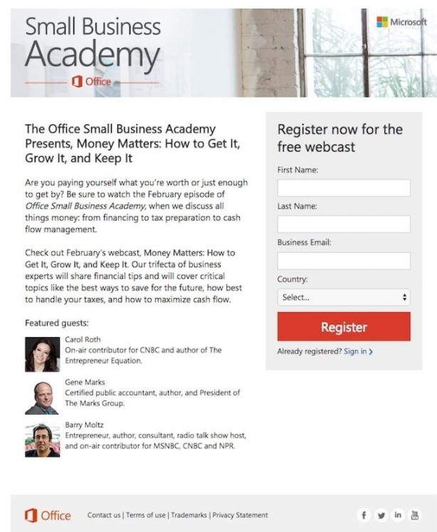
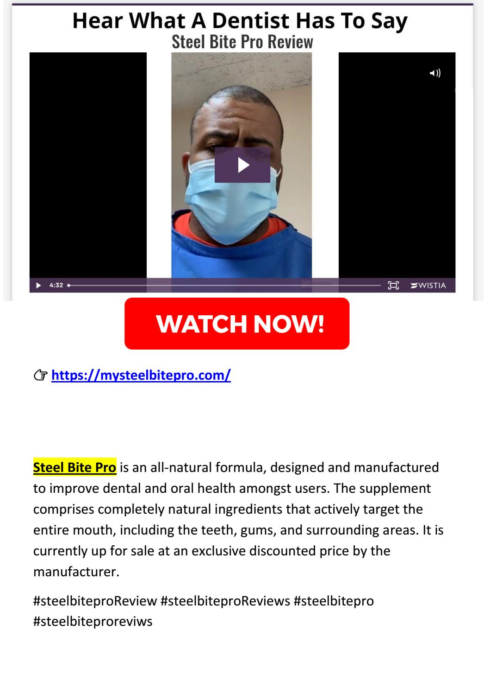
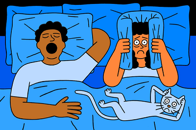

With 2 billion monthly active users on Facebook, you might wonder if Facebook advertising is the best course of action to help you scale.

in a recent [Socialbakers](https://www.socialbakers.com/blog/2106-the-value-of-socialbakers-ad-analytics-for-facebook-advertising) survey of marketers showed that 92% of respondents use Facebook advertising; almost everyone is doing it!

## Why FaceBook ads

The official [facebook ads](https://www.facebook.com/business/help/205029060038706) website has a list that outlines the many reasons why advertising on Facebook is a smart choice for businesses. let's see the ones relevant to us:

- **Anyone can advertise** : There's a range of advertising options to help you reach your business goals regardless of your advertising experience.

- **Audience on Facebook** : As mentioned, there are 2 billion people active on Facebook each month. That means you have the opportunity to reach current customers, new customers and people interested in your business or organization.

- **Ads tailored to your specific goals** : Facebook offers a range of advertising objectives, so you can choose the options that suit your needs and business goals.

- **Targeting capabilities** : Most important feature for affiliate marketers. Facebook ads can be targeted to people by location, age, gender, interests, demographics, behavior and connections.

  You can also use more advanced targeting tools like **Lookalike Audiences**, which lets you target people similar to the people who already engage with your business,

What impresses me every time i use FaceBook Ads is the **Targeting**. I Like to narrow my audience as much as possible. so i don't spend a dollar on someone with no interest on my offer.

> **N.B:** Facebook ads compliance is also very strict. But i'll show you how you can stay on the Safe Side as long as you don't break any law.

Do not be discouraged if your ads don't get approved in the beginning. or you get your ads account banned. this happens a lot ! Facebook is strict when it comes to affiliate marketing and if you promote Health offers. it will be a nightmare in the beginning.

## Why ClickBank

[ClickBank](https://clickbank.com) is a top 10 affiliate network . It is one of the oldest affiliate networks still in operation today. The ClickBank marketplace has been working since 1998.

ClickBank offers some of the most significant commissions you can find online (up to 75%), and it lets marketers choose from all kinds of products. It's not niche-specific, and it doesn't limit you in picking the products you'd like using and reviewing.

## ClickBank and Facebook

<!-- https://sell-saas.com/can-you-advertise-clickbank-products-on-facebook -->

As i stated before. Facebook is strict when it comes to affiliate marketing. and guess what it gets harder to get your ads approved if you use referral links directly in your creatives.

This does not mean it is impossible on Facebook. You just need to **adjust your approach** to this platform as a ClickBank member looking to promote physical or digital products there.

The standard approach are

- **Direct Linking**: This is the fastest method of referring people. But you will not get away with it on Facebook. i personally got many ads rejected using direct linking.

- **Links inside Content**: Facebook allow affiliate links on comments, posts, and groups. you can write content and include your links there. and then create an ad to that content.

- **Bridge Page**: (AKA Landing Page). This is the most efficient way of marketing. you have control over your page. and you can make it Facebook Compliant . **We will use this method**

> This article explains the Landing Page strategy using Facebook ads.

## How to Promote ClickBank Products on Facebook

Let's go over the strategy and explain every step in details.

1. Picking a product
2. Creating a converting landing page
3. Create a compliant facebook ads

## How To Choose A Product on ClickBank

Sometimes you do everything right on the landing page and audience targeting. You get clicks on your ads. and then clicks on your affiliate link. but still make no profit.

It is usually the Product itself that is not converting. this is how i decide when picking a product from ClickBank to promote on FaceBook.

- ## 1. Product Niche

Product Niche is very important when using facebook ads. let's take an example of 2 campaign i tried before. promoting a puppy toy is different from promoting weight loss pills. here is what i found:

- targeting puppies owners is easier than targeting overweight people. and you never know if they are are interested in weight loss pills or they do not take them.

- people on facebook tends to stay on facebook. unless they see something they really like ! they would not follow a link that take them out of facebook.

- a cute puppy can be approved easily on ads creatives. but body parts are not allowed on facebook. Before/After photos are not permitted too. so you are left with illustrations that hints to weight loss. good luck getting people to click on it.

- Facebook will actually help you once your campaign starts getting conversions. and you can build a look-alike-audience to target them again later with more puppies offers.

- Weight loss offers are not beginners friendly at all. they are very competitive on facebook and you have many aspects to focus on when creating your landing page.

> If you are a beginner, i advise you against weight loss offers on Facebook. get familiar with other offers first before going for this highly competitive niche.

- ## 2. Product Statistics

ClickBank market place provide relevant product statistics on the main page.

Let's see an example of the hottest product on ClickBank at the time of writing.

_A conversion on this product means A Sale_

- **Avg $/conversion** : This is the amount you will be paid on **average**. calculated using other affiliates data. you may get different commissions.

- **initial $/conversion**: This is how much you will be paid without an Upsell. this is usually when the customer buy a bundle. if he buys a single bottle. you will get a loss less than that.

- **Recurring $/rebill**: Some products have a subscription plan or a refill. when a client you referred the first time buys Again. you also get your share for every time he buys again. This is called recurring payment. it is the best form of passive income.

- **Gravity**: The most important stats of ClickBank is Gravity. they do not give details of the calculation but it is widely thought to be as follows:

  Gravity is a performance statistic. a number which represents a unique calculation by ClickBank that takes into account the number of **different affiliates who earned a commission** by promoting this product over the **past 12 weeks**.

  Since more recent transactions are given a higher value, this number can give you an idea of what products are **“hot” at the moment**.

Products with gravity over 150 are always on top of the list. they tend to be very competitive. on the other hand products with less than 40 gravity are new to the market and slightly unknown to the world.

> Do not go for product with gravity lower than 45. an average payment of $70 and higher will make sure you break the campaign even or get profit when you start testing. Recurring is a bonus.

- ## 3. Vendor Page and Refund Rate

When someone clicks on your referral link they get redirected to the vendor page. so what is the logic thing to do next ?

Visit the vendor page !

- One mistake you should not fall for is promoting to people on Phones. and the vendor page is **not responsive**. always check the vendor page on mobiles and desktop too.

- if it is a TSL - Text Sales Letter - check the headers and the theme the page is using. you may build your landing page around it using the same color scheme. to make it **congruent**.

- if it is a VSL - Video Sales Letter - you can copy the **thumbnail** and use it in your landing page to send people to the video. it will keep the user experience neat.

- Countries Allow: check what countries the vendor **covers shipping**. you don't want to spend money advertising to countries the vendor does not ship to. this is money lost.

One thing that ClickBank statistics does not show on the marketplace. is the **refund rate**.

it is very important to contact the vendor and ask them about the refund rate. what traffic source is working best for other affiliates. creatives they can provide to help build your landing page. and whatever you like to know about the product. you won't believe how much information they can provide.

- ## 4. External Websites

There are a lot of websites that provide ClickBank statistics.
the only website i use is [CbEngine](https://cbengine.com/).

What makes CbEngine my favorite is the Graphs they provide in addition to ClickBank statistics.

- **Gravity**: same as ClickBank but it show how much it changed. it saves you from promoting a dying product.
- **First Seen**; some products are added to ClickBank, removed , and then added back again as a relaunch. make sure to check the last time stats.
- **History Graphs**: a lot of graphics are available on the GRAPH tab. history of payout. gravity. popularity. and commission is all shown with dates. this will help you a lot.
- **Free Plan**: CbEngine offer a PRO version with more options and tracking. but the Free Plan alone will help you decide on a product.

> Use CbEngine to investigate products further. and narrow down your list of potential offers.

- ## Product Picking Conclusion

Choosing the right product can be challenging in the beginning. but if you follow these 4 steps. take your time and make a list of potential products to promote.

it is easy to narrow it down to a final winner. A Converting product is a Major Factor of a successful campaign.

> Always see the product as a buyer. Would you but it ? and be honest when promoting it. Do not lie to people.

## Create A landing Page

Now that you have a product. it is time create the Landing page. this is the page users will land on after they click on your ads.

With a landing page, the process of directing the user and make them perform a particular action also gets simplified.

By creating a specific landing page, you can effectively tailor the customer’s experience, providing eager users the exact info they need to check.

## Importance of Landing Page.

Direct linking vs Landing page is a question that i see a lot. i will state the benefits of using a landing page that you will lose if you direct link.

1. Build an Email list for future promotion.
1. Ability to control the content and split test what works what does not.
1. Ability to pre-sell your leads to get very high conversion rates from leads you send.
1. Writing articles and gain client trust before promoting to them.
1. Tracking Campaigns, what works. and what it losing you money.

there are 5 simple benefits you will lose the second you do not use a bridge. there is a reason All Successful affiliate use a landing page. and do not think of it as Extra work. imagine spending money to promote a product a directly link users to the vendor. you have NO CONTROL over the funnel. you have no optimization or personalization that makes your campaign different.

## Types Of Landing Page

In affiliate marketing. the 3 most common landing pages are Lead Generation. Review Pages. And PreSell AKA PreLander. they differ from each other in layout and purpose.

- **1. What is a Lead Generation Landing Page?**

The main purpose of a lead generation page is to collect specific information of the Client. to be used later.

Most common is the user's email address and name.

the typical layout is a colorful nicely designed template with a form to fill the user info and a big call to action button.

When the client clicks on your add. he will be forwarded to your lead generation page. once he fill in the form (lead generated). there are 2 types called :

- Single Opt-in -most common-: Client gets redirected right after filling the form. even if the email does not really exist.

- Double Opt-in: You create a secondary page called the **Thank you page** . when the client fill in the form. you send him an email with a link to this Thank you page. then redirect him to the offer.

Lists generated with single opt-in may have wrong emails or people who just wanted to see the one offer. and not interested in following your emails.

as Double opt-in requires the client to access his email and then confirm it means he is interested and will potentially convert. be careful that this also is a Repulsive action. some people see this as a burden. and won't follow your lead.

- **When To Use Lead Generation Page?**

Some vendors also do lead generations on their page. if the offer you are promoting is doing it . you probably should not. when was the last time you were asked for your email twice in a row ? and did not get suspicious.

Lead generation works best when you provide a freebie with it. You can always use free of copyright ebooks.

E-mail marketing is considered one of the best affiliates channels. You slowly build a list of people who have a common interest in a topic. and you keep promoting to them in the future without spending more money on the adds.

- **2. What is a Review Landing Page**

as the name dictate it. you will review a product or a service and provide additional details and experience about it.

this type of Landers is very common with search ads. but can also be altered to work with facebook ads.

the most common type of review pages is Advertorials style. you will write an article that answers the frequently asked questions. and give your final thoughts or a conclusion.

type any product name on google and add "review". you will be presented with a lot of website doing reviews of different products and services. and they all provide a referral link to the product in the end.

the best choice for beginners is the Review Page.

This is an example of a Chef's Knives comparison with a conclusion and link to amazon

- **When To Use Review landing Page?**

Review pages can be used on different angles and niches. they are very common on health related products because you need to provide a lot of information to the reader before he decides to buy.

Review pages works best when you have the product in hand. you are a real customer who tried the product and is now sharing personal experience.

A review page tends to build some confidence on the first tier of the article. then provide call to actions in the middle.

- **3. What is a Presell page**

A pre-lander is a page which appears right before an actual offer.

Generally, the objective of a pre-lander is to act as a warm up for the visitor. and when Direct Linking is not a viable option.

Users check the pre-landing page, and they get a sense of what the actual offer is gonna be all about.

A pre-landing page has a clear Call-to-Action with no distractions that could confuse potential users, leading them to convert.

- **When To Use Presell Page?**

i am pretty sure you have seen a Presell page before. they are so popular on Native ads.

a presell page can be used whenever you don't want to force the client to fill a form -lead generations- and you are not providing a -review- of the product. so you warm up the offer and add a gentle introduction.

## Landing Page Conclusion

Creating a Landing Page is a key step. and you should get yourself familiar with it if you want to be a successful marketer .

Since this is about FaceBook ads. Let me tell you right now . Quiz Pages -considered a lead generation page- are actually the best this year. they convert like crazy. as long as you set them up right. this is how i set up mine.

let's take an example of a Snoring Solution Product.

- **1** User see my ad in facebook that has a catchy image (scroll stopper) .
  

- **2** Now i got the user attention. let's make him click. "If you or your partner snore. You have to see this"

- **3** Once he reaches my landing page. i will ask him snoring related questions with easy yes or no answers.

- **4** On the final question. usually 6-7 are enough. redirect him to the offer after creating some kind of suspense.

If you would like to collect emails you can do it on the final quiz question. you have a higher chance the user will fill in the form than if you do it on start.

> You can try other types of landing pages. it all depends on the product and the strategy you are building. After you get some experience. deciding on the landing page style will be a matter of seconds.

## Creating A Facebook Campaign

Now that you have a nice landing page. it is time for Facebook Ads.  
In order to create a campaign on facebook. You need to have a facebook page of course. use an existing page or create a new one if you like.

but first things first. Are you promoting an Image+Text (post style) or a video ?

**Video Creatives**

if you are going to use a video. you have to follow facebook guides and they are very challenging. also You have a small duration before the user can click "Skip video".

in this short duration you have to catch the user attention so he does not just skip your ads. (like you and i do all the time )

i can not tell you a lot more about this. because i tried it only once and failed. i use YouTube when i want to run video ads.

**Image Creatives**

Illustration images are the best. just take yourself as an example. you are scrolling your feed. what images Stop you ? the ones with Click Bait circles and images that are intriguing somehow.

The image i used before in my example is actually a nice one that worked in the past. a nice Scroll Stopper.

prepare your images and use whatever resolution facebook requires.

Facebook ad images have a recommended resolution of 1,200 x 1,200 pixels for News Feed, Right Column, Instant Articles, Marketplace, Native Ads, and Sponsored Messages.

**Headlines and Primary Text**

Do not underestimate the power of the headline. as i stated before we use the image to catch the attention. and the title to make the user click on our ad.

Create more than one ad per campaign. use facebook A/B testing to see what images/text combo gets you more clicks

> creating ads on facebook is really easy if you prepared your images and headlines already. they have a user friendly UI and very interactive.

## My Experience On FaceBook With ClickBank.

I haven't done a "how to create a facebook ad" because it's simply adding images, add text and click next.

Also it changes from time to time. so it'll eventually be outdated.

What i want you to focus on and not fall for the same mistakes is the following.

- **Know Your Audience**

No matter what kind of marketing strategy you have, you shouldn’t begin any process before you get to know who your target audience is.

This is what’s either going to make or break your campaign, let's take an example.

say you are running a campaign for an anti-aging moisturizer. You believe in this product from the bottom of your heart, and it’s just perfect.

You start advertising your product to everyone—all ages, genders, locations, etc.

Now it’s the end of the month, and you’ve made only two sales. This is the point where you start thinking to yourself

what could have possibly gone wrong?

The truth is, you were so blinded by how the product turned out that you failed to realize that not everyone needs it.

Your Facebook ads were reaching 22-year-old boys from Michigan who didn’t spend a split second looking at your product. All of that, only because you didn’t target your audience properly.

- **Target Only Your Audience**

  - How old is my buyer ?
  - Where do they live?
  - What do they do for a living?
  - Do they have a stable income?
  - Are they in a committed relationship?
  - does my product solve a problem the have?
  - Why would they refrain from buying this product?

once you have answered all these questions you are ready to narrow your audience to the right buyers.

- **Add an an emotional Side**

No matter what you are selling , you need to take your customers on an emotional rollercoaster.

Remember that it’s always an emotion that sells the product and not a plain product description.
