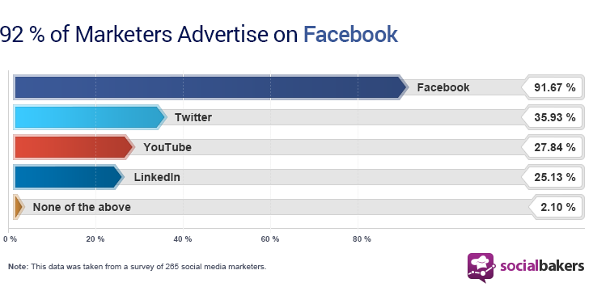
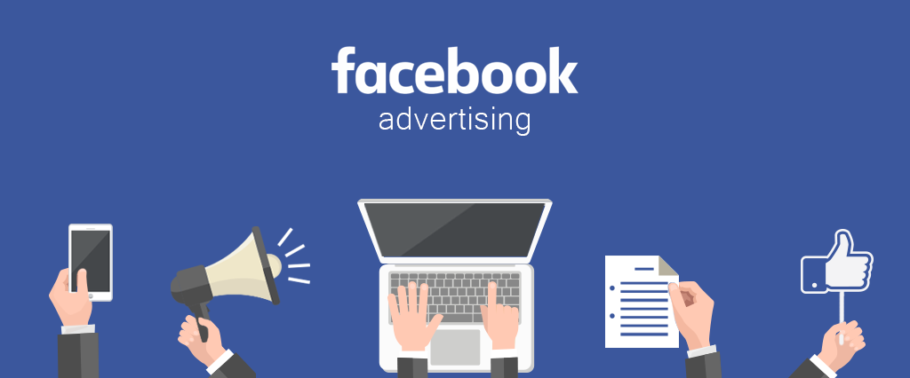
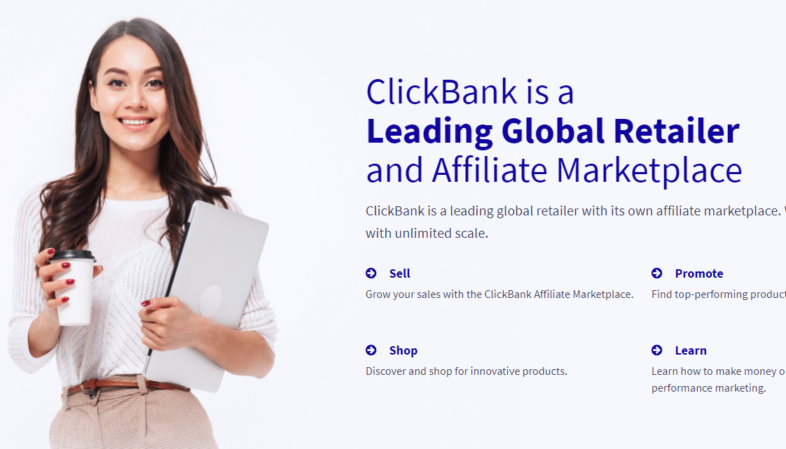

With 2 billion monthly active users on Facebook, you might wonder if Facebook advertising is the best course of action to help you scale.

in a recent [Socialbakers](https://www.socialbakers.com/blog/2106-the-value-of-socialbakers-ad-analytics-for-facebook-advertising) survey of marketers showed that 92% of respondents use Facebook advertising; almost everyone is doing it!

## Why FaceBook ads

The official [facebook ads](https://www.facebook.com/business/help/205029060038706) website has a list that outlines the many reasons why advertising on Facebook is a smart choice for businesses. let's see the ones relevant to us:

- **Anyone can advertise** : There's a range of advertising options to help you reach your business goals regardless of your advertising experience.

- **Audience on Facebook** : As mentioned, there are 2 billion people active on Facebook each month. That means you have the opportunity to reach current customers, new customers and people interested in your business or organization.

- **Ads tailored to your specific goals** : Facebook offers a range of advertising objectives, so you can choose the options that suit your needs and business goals.

- **Targeting capabilities** : Most important feature for affiliate marketers. Facebook ads can be targeted to people by location, age, gender, interests, demographics, behavior and connections.

  You can also use more advanced targeting tools like **Lookalike Audiences**, which lets you target people similar to the people who already engage with your business,

What impresses me every time i use FaceBook Ads is the **Targeting**. I Like to narrow my audience as much as possible. so i don't spend a dollar on someone with no interest on my offer.

> **N.B:** Facebook ads compliance is also very strict. But i'll show you how you can stay on the Safe Side as long as you don't break any law.

Do not be discouraged if your ads don't get approved in the beginning. or you get your ads account banned. this happens a lot ! Facebook is strict when it comes to affiliate marketing and if you promote Health offers. it will be a nightmare in the beginning.

## Why ClickBank

[ClickBank](https://clickbank.com) is a top 10 affiliate network . It is one of the oldest affiliate networks still in operation today. The ClickBank marketplace has been working since 1998.

ClickBank offers some of the most significant commissions you can find online (up to 75%), and it lets marketers choose from all kinds of products. It's not niche-specific, and it doesn't limit you in picking the products you'd like using and reviewing.

## ClickBank and Facebook

<!-- https://sell-saas.com/can-you-advertise-clickbank-products-on-facebook -->

As i stated before. Facebook is strict when it comes to affiliate marketing. and guess what it gets harder to get your ads approved if you use referral links directly in your creatives.

This does not mean it is impossible on Facebook. You just need to **adjust your approach** to this platform as a ClickBank member looking to promote physical or digital products there.

The standard approach are

- **Direct Linking**: This is the fastest method of referring people. But you will not get away with it on Facebook. i personally got many ads rejected using direct linking.

- **Links inside Content**: Facebook allow affiliate links on comments, posts, and groups. you can write content and include your links there. and then create an ad to that content.

- **Bridge Page**: (AKA Landing Page). This is the most efficient way of marketing. you have control over your page. and you can make it Facebook Compliant . **We will use this method**

> This article explains the Landing Page strategy using Facebook ads.

## How to Promote ClickBank Products on Facebook

Let's go over the strategy and explain every step in details.

1. Picking a product
2. Creating a converting landing page
3. Create a compliant facebook ads

## How To Choose A Product on ClickBank

Sometimes you do everything right on the landing page and audience targeting. You get clicks on your ads. and then clicks on your affiliate link. but still make no profit.

It is usually the Product itself. this is how i decide when picking a product from ClickBank to promote on FaceBook.

## 1. Product Niche

Product Niche is very important when using facebook ads. promoting a puppy toy is different from promoting weight loss pills. here is what i found:

- targeting puppies owners is easier than targeting overweight people who are interested in weight loss pills. and facebook will actually help you once your campaign starts getting conversions. and you can build a look-alike-audience to target them again later with more puppies offers.

-

## Creating A landing Page

## Creating Facebook Ads

## My Experience On FaceBook With ClickBank

## Conclusion
