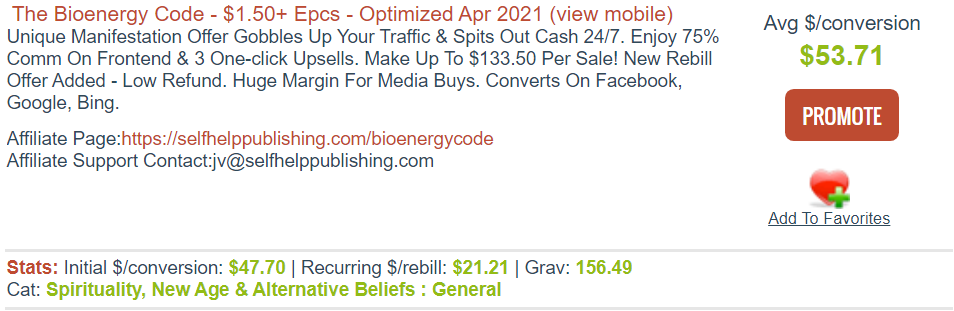
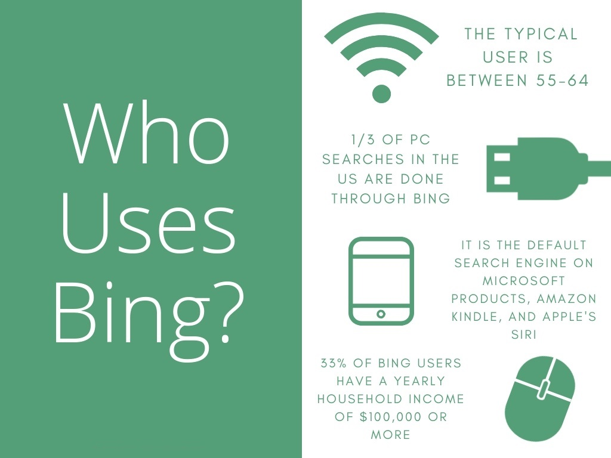
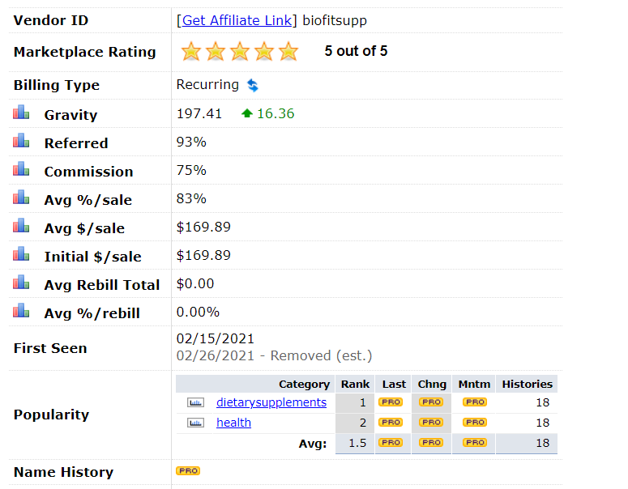
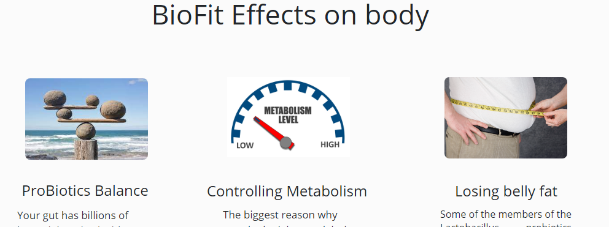
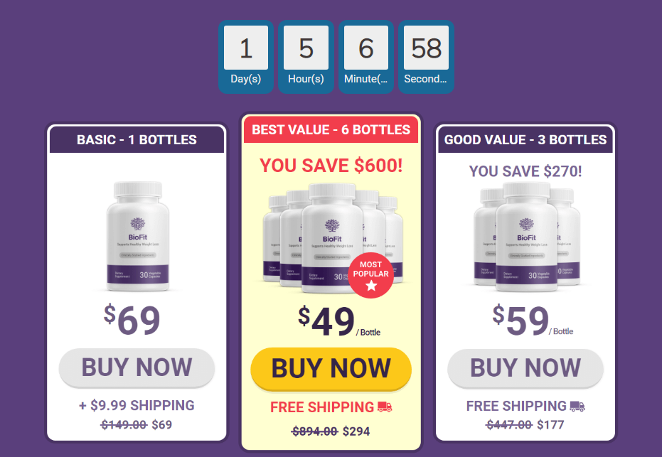
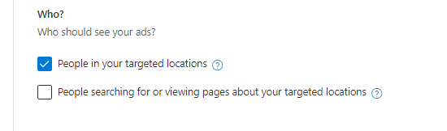
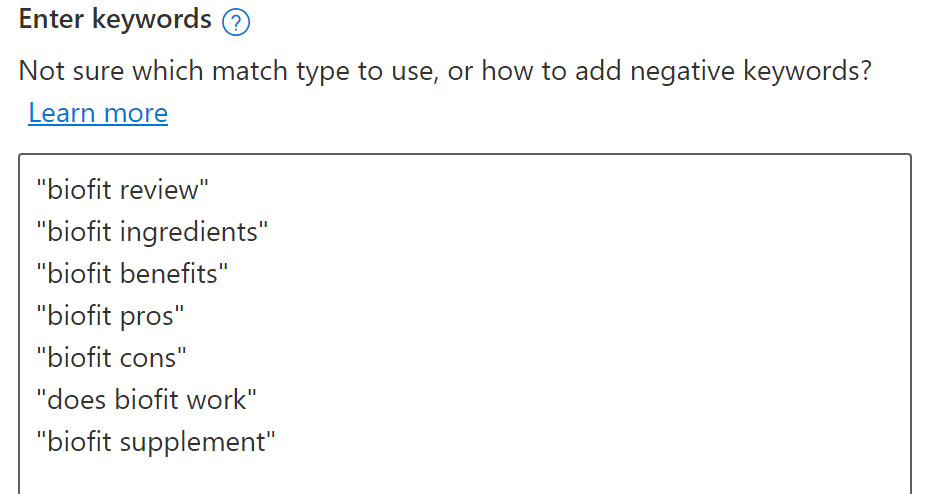
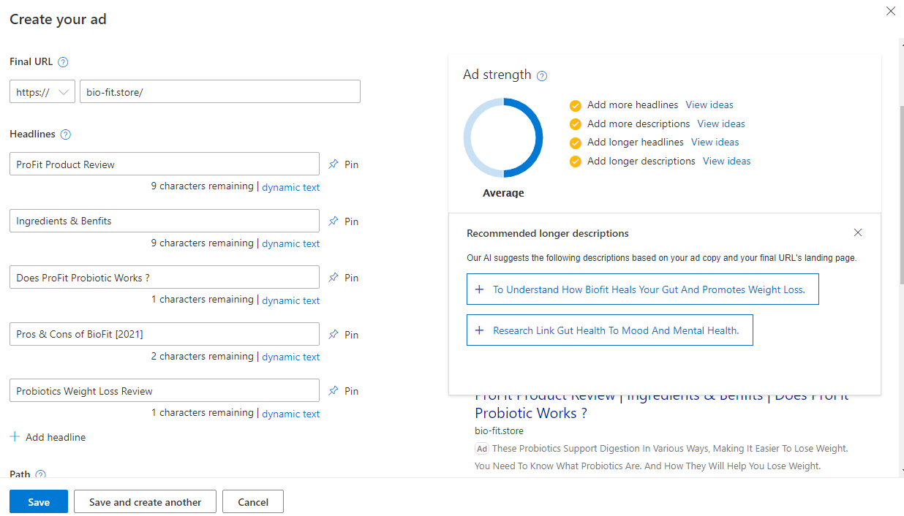
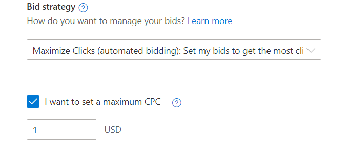

If you're new to affiliate marketing. the first thing you try is promoting offers on standalone pages. not everyone starting has a huge blog or a popular social media account to use as traffic source.

So the most common way is to pick a good product. create a landing page for it. then start buying traffic in hope to get visitors to click on your referral link (Call-To-Action) and convert.

Let's cover how to create your first affiliate marketing campaign step by step and show some mistakes beginners fall for.

1. How to pick a winning product
2. Creating a landing page
3. Launching A Campaign on [bing](https://ads.microsoft.com/)

## 1. Picking a winning Product.

You may have the perfect landing page. and you target the right audience. but no one is buying

Picking the product is Key. if you show your neighbor to a bad laundry service and he can spot the incompetence. he won't stay just because you referred him.

When picking an offer on [ClickBank](https://www.clickbank.com/) there are many things to consider.

## A. Product Statistics

First of all. we need a product that is already working for other people. and it has a high conversion rate. ClickBank calls it Gravity.

**Gravity** is a ratio of conversions made in the last 2 weeks. provided by ClickBank. if it is over 150. the offer is converting. but it also means it's very competitive.

- Pick a product with a gravity between 60 and 150. Higher is Harder. Lower usually has no traffic.

**Commision** value. the amount we get paid should cover our money spent. do not be afraid to go for high commission offers.

the general rule is to spend 3 times the amount you will get paid before you kill a campaign.

if the offer pay you $20. a budget of $60 may not be enough to test the product.

- The offer should have an average $/conversion of 75$ or more.

**Refund Rate** this is not provided by ClickBank. and it is an important factor. what good is it to spend money and bring a client. then he decides to return the product for a refund.

A refund amount will be cut from your share of the sale too.

- You should always send a message to the affiliate support for more information. Always ask about the product refund rate.

> Conclusion: Pick a product with a gravity over 60 and an average commission of $50. and the refund rate should be less than 4%.

## B. Product Niche.

The product niche is as important as its statistics.

there is a product with $737 initial conversion and a $955 average. but it is so hard to promote it has a gravity of 1.23 at the moment of writing.

It is not easy to convince a visitor to pay such amount of money after one search.

The business/marketing niche is not usually easy to promote.

**Health or Spirituality** niche converts better. because people buy similar products in real life or order them on Amazon. it is not something out of the routine.

Affiliate marketing is easy. do not make it hard on yourself. Follow what is working.

You will not sell an Expensive Trading Bot to a mother of two that just searched on bing for "passive income online".

> But you can easily sell a Weight Loss Tea to anyone who searches for "Weight loss supplement"

## C. Advertising Platform

This is exactly where most affiliate marketers fail 😐.

let's say you have picked a good astrology product with good gravity and payout. now you want to promote it on bing. this is extremely prone to fail.

Read the Bing Demographics chart below.

This tell us that the average bing user is aged between 55-64. they use it because it's the default search engine on the device. only a 1/3 of PC searches in the USA are done through bing.

Now read this carefully.

In 2018, the [Pew Center](./https://www.pewforum.org/2018/06/13/the-age-gap-in-religion-around-the-world/) reported that **Millennials** are less likely to attend regular religious services than earlier generations. They are, however, just as likely to consider themselves **spiritual**.

Millenials are the best audience of Spirituality offers. But they are not the **main users of Bing Search**.

I am not saying this campaign will certainly fail. but it has a higher chance to succeed if promoted on a different platform that has a younger audience.

- When promoting on Bing Ads. Keep in mind that older people are the main citizens. pick a product that is interesting to older people and teenagers as well.

> ## Recap On Picking A Product.

When you are hunting for a ClickBank Offer to promote on Bing ads. Keep in mind that ClickBank statistics are not the only thing that matters.

the product niche should be working for other affiliates too. and it is a product that is interesting to the audience you are targeting.

## 2. Creating a landing page

Now that you have selected a product to promote. it is time to create a Landing page to start pumping up the visitors to buy.

[MicroSoft ](https://ads.microsoft.com/) Ads (_AKA_ Bing Ads) allow direct linking campaigns.

But i will never advise you to do it. Always use a landing page.

let me just give you few arguments against direct linking. because the article is not about it.

- Other affiliates will use a landing page and optimise it over time. this will give them more control and eventually rank better than you.
- MicroSoft Ads allow direct linking. But they hate it. even if you increase your bid. Campaigns with landing pages will be ranked higher than direct linking.
- You do not have control over the vendors page. This means you do not have any control over the whole campaign.
- Affiliate Marketing requires efforts. by using Direct linking you are not learning anything. even on successful campaigns.

Now that i hope i convinced you to do the right thing. let's talk about the strategy that worked for me . and should work for you too.

## Product Review Landing Page.

You should always consider creating a review page style. if you are a beginner or on a budget. it makes more sense to narrow the audience.

by creating a review page. we decide on the whole campaign strategy. and here's why you have a higher chance to make money out of it.

let's say we picked the offer called [BioFit](https://cbengine.com/id/biofitsupp) from ClickBank.

it answers all the product picking steps we previously agreed on.

Now if you had a $3000 budget you are ready to invest (win or lose). i will tell you to stop reading this article right now . and use native ads to promote it.

But let's make it work with a $100. how do we do it ?

Only promote to people who already know the product exist and have heard of it. but they just need a small push to buy.

> **If you are looking for a product review. it means you already know the product. but you are hesitant to buy it. you just need someone to tell you to do it !**

So you go and search for **"BioFit review"** or **"Does BioFit work ?"**.

this Keyword triggers my campaign and show my ads. you click on it and you get redirected to my landing page.

You see a picture of the product and a big title saying **Biofit Product Review**. you keep on scrolling and reading the information i've previously collected.

As you are reading my review. i slowly convince you to give it a try. and in order to rush you a little bit i emphasis on the limited discount the vendor has setup.

every image or button has my referral link and at any point you decide to buy the product you will click on my Call-To-Action and get redirected to the vendor page.
Buy the product. ClickBank will register it. and pay me.

> **Give it a try right now. type any product name on any search engine and add the "Review" keyword. you will witness this strategy in action. on any product or service you try. because it works !**

## Landing Page Mistakes

By creating a landing page. you have full control of the user experience.

You can easily make mistakes that will repel the visitor you payed money to get to your website. here are some popular pitfall to avoid.

1. **Be Honest**. Do Not Lie to the customer or promise anything the vendor did not. you are only hurting yourself doing this. and you may even get banned. All ClickBank products have a refund policy.

   The client will eventually have the product on hands. and realise something is wrong and you were lying about it. so he asks for a Refund. and you will lose the money you got in the
   first place plus the amount you spent on ads.

2. **Distractions**. Do not promote different offers on your landing page. the visitor is already hesitant to buy the product and is looking for a Review. Do not give him more reasons to start considering other products you put on your page because you thought it's a good idea to show many offers. it won't work.

3. **The Title** must be congruent to the search. It must contain the keywords that triggered the ads.

   the visitor was redirected to your page after typing the Product Name + "Review" "Ingredients" or "Benefits". the title should not say "Breaking Research discovers the root cause of hearing loss".

   You can do it in subtitle. if the title is different. users tend to go back on the first 4 seconds thinking they landed on a different page.

> Related: Read this detailed article ["Creating a landing page that converts"](https://digincome.com/affiliate-marketing/landing-page-that-convert/)

## 3. Launching A Campaign on bing

The last step of the journey. Launching a campaign. this is relative. if you have done your product research and created a landing page that converts well. launching a campaign is easy.

- login to your [Microsoft Advertising](https://ads.microsoft.com/) account.
- click on create a new campaign. choose visits to my websites. then Search ads.
- give your campaign a name. add targeted area and product name for ease of access
- set a **campaign budget**. i usually do $100/day for ranking reasons. you won't be spending it in real.
- Choose **Specific locations**. this is an important step. **do not promote** to countries where the vendor does not cover shipping.

  if it is a digital product do not promote Worldwide in a new campaign. always start by testing on Tier 1 countries that are know to convert. USA, Canada, New Zealand, Australia are always in my list.

- Pay attention to these 2 checkboxes.

  

  Uncheck the second box that show our ads to people searching for content about targeted locations. it contradicts our location targeting.

Save and go the next step. **Ad Groups**. this is where you enter your website url (you should have a domain name now).

Ad Group name should reflect the keywords in it. since we are doing a review page strategy. we only need 1 ad group in the beginning. name it whatever you can remember.

now the most important step when creating a campaign. Entering keywords

## Campaign keywords

Bing ads support 3 types of keywords matching.

The keyword match type will be broad match unless you use quotes -- "Keyword" -- to indicate phrase match or brackets -- [Keyword] -- to indicate exact match.

- **Broad** will match any search that has at least one of the keywords we selected. it is bad in our case.
- **Exact Match** is indicated using brackets -- [Keyword] -- . this will not trigger unless the user type your keywords exactly. without adding or removing anything. it is the strictest and does not work for us too.
- **Phrase Match** you use quotes -- "Keyword" -- to indicate phrase match. this is the type we will use. because it matches our strategy.

It is only logical that our first keyword should be "BioFit Review" this will work if the user type Biofit product review. or user review. because it matches

Now we add some variations to cover all possible words a user looking for a review can type.

Click next to get straight to the first Ad Creation. and enter your landing page url one more time.

this is where title and landing page **Congruency** plays a major role in getting you the clicks desired. or burying you down the ranking list you will not be seen again.

Your Headlines should reflect what your page contains. Your descriptions should be intriguing the user to click and hinting that there is more content on the website.

Bing provides an Ad Strength Meter. You should hit Average. nothing less

after you create the Ad. hit save . scroll down past "SiteLink and Callout extensions" because we use them later to scale the ad.

Click save & go to the next and final step.

## Budget & Bid Strategy.

here is where you limit the daily budget you are ready to spend. and apply a Bid strategy so you do not lose money.

Each platform provides different bid strategy. one common strategy between google and bing is the **Maximize Clicks**. set your campaign bidding strategy to maximize clicks because it's the perfect strategy to new campaigns.

**Always set a maximum CPC** : never forget to set a maximum Cost-Per-Click. this is how much you are willing to pay for your ad to show. i always start low with $1 maximum. until the add gather some data. and then i increase it for the keywords that are driving sales.

This is the last step of campaign creation. after hitting Save. you will wait for Microsoft ads team to review your campaign and approve of the keywords. once approved. You are Live. give it a couple of days before you start seeing visitor and hopefully they convert and you get paid a good amount of $$$.

> Campaign Creation is a result of a good product research and landing page creation. what matters the most is the **Audience Targeting**. in Search Ads.
> it's done with keywords and location targeting.

## Final Thoughts

Promoting Affiliate programs on MicroSoft Ads is all about the strategy.

If you take your time on product research following the guides i provided you. and create a landing page that answers the frequently asked questions about the product. You will make your first hundred dollars on ClickBank.

Just remember:

- When choosing a product to promote. consider the Bing Ads demographic not only ClickBank statistics.
- If you are a beginner or on a budget. Doing product Reviews is a proven strategy.
- When Creating the landing page. Do not fall for the mistakes i cited previously.
- When Launching the campaign. Titles and Keywords should be in harmony.
- Mind the user experience. Answer his questions.

everyone is doing it and making a decent amount of money. what is stopping you ? tell me in the comments and i will gladly help.
