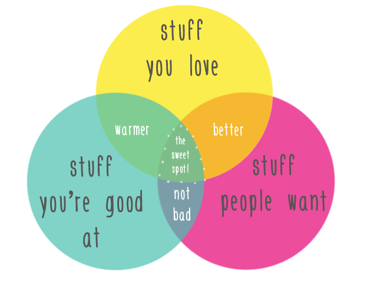
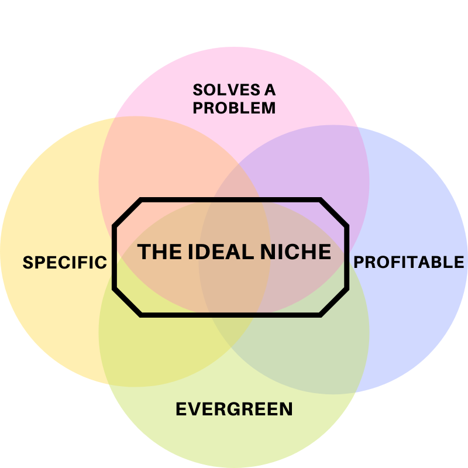

When starting affiliate marketing. jumping between different niches is the first mistake beginners fall for. you will end up losing money on testing funnels each time you switch to a different topic.

## What is Affiliate Marketing

Affiliate marketing is the process of earning a commission by promoting another company's product (or service). You find a product, promote it to others, and earn a piece of the profit for each sale that you make.

> If you are new to affiliate marketing. Read this detailed [Introduction To Affiliate Marketing](https://digincome.com/Affiliate-Marketing/what-is-affiliate-marketing/)

Successful affiliate marketers have one thing in common: They **Focus** On A Profitable Niche.

## What is a niche

A niche is a **focused, targeted** area that you serve particularly well. It is small (and the smaller the better). It is **specific**. It is known to you. For example:

**An organic bath soap.**

normal bath soap is a large market and is mass-produced and bought in large quantities. You do not want to compete against giants like [Dove](https://www.dove.com/).

Organic Bath Soap is considered a niche product. Companies in this soap segment aren’t as large,and there is a smaller group of people buying it.

But do not be fooled into thinking a niche is not competitive. and it only has a small group of potential customers. the top 20 profitable niches are **highly competitive**.

So if you want to succeed you will do a Niche-Down. (AKA Subniche or Micro-Niche).

## What is a Subniche.

A sub-niche is simply a smaller segment of a niche.

Take the illustration above for example.

- **Gardening** is a general topic. attracting different kind of people.
- **Gardening in a city** narrows it down for at least a half. it is a Niche.
- **Rooftop gardening in a city** is a subniche. You know exactly who is your audience.
- To narrow it further more and hit the bull's eye. we can add specifics like **"Rooftop Gardening New York City"**.

to understand a subniche better. let me ask you . what will google images show if you searched for "Gardening" vs "Rooftop Gardening in your area" ?

> **Targeting a subniche is hundred times more efficient and give you higher chance of success**

## Picking a Subniche

## 1. Consider Your Own Interests

You will be recommending products to people and referring to different websites. You have to be involved.

Many affiliate sites die due to a lack of consistency.
and you can not be consistent about something you do not understand or write articles about a topic you have no passion about.

i am confident that i will fail if i start writing about "Fashion For Men" because i am not good at it. i do not love it. even though people want it.

To quote a well-known phrase

> **“pick an occupation you enjoy and it will never feel like work”.**

## 2. Check Monetization Options

if we go back to the example of **Rooftop Gardening** an ideal product to promote would be the tools needed for beginners. so you can recommend a tool you are using. or do a comparison between different brands.

So visit Amazon to discover which products affiliates can promote in the niche. These products should be high quality items that you would be comfortable recommending.

It is always wise to select a niche that has **several monetization options**, so you can establish multiple streams of income.

if Amazon for example decide to reduce the profit share (it happened before already) you can always find different Affiliate Networks and stay in business.

> **Read This detailed article "[What is an Affiliate Network And How To Pick One](https://digincome.com/Affiliate-Marketing/what-is-affiliate-network/) **

## 3. Medium Competition, High Search Volume

I said that a subniche is better than a niche because of the high competition and generality of the top niches.

this does not mean you should pick a subniche with **little to no competition**.

subniches with little competition are best avoided, because this usually means that the profit potential is limited.

your goal is to find a profitable niche. and narrow down to a subniche and still stay on the profitable side.

The sweet spot is a subniche with a **high search volume** but medium to **average competition**.

## 4. Market Deficiencies

To profit from the niche you enter, you have to provide **superior website content** to the other websites in your niche.

To do this, you should determine where the content produced by your competitors falls short, and devise ways to enhance it.

Read the content published by the top websites in your potential niche and **note** down any problems with it.

If the competition is doing something wrong . consider how you could do it better. Perhaps you could make the content more in-depth by including some case studies and detailed examples.

A good method to identify such omissions is to read the blog comments on these sites. The **negative reviews** of niche-related books on Amazon can shed light on what type of content your audience wants to read as well.

## 5. Subniche Sweet Spot

There are different angles to a converting product.

A successful product should answer 4 questions. illustrated in the image below

### A. Does the product solve a problem

As Theodore Levitt, an American economist and professor at Harvard Business School, once said:

> **“People don’t want to buy a quarter-inch drill, they want a quarter-inch hole.”**

The ability to solve someone’s problem is what makes a product great, not the number of features it offers.

Best offers to promote are products that solves a problem

### B. is the product EverGreen

For a product to be evergreen, it means it can be purchased at any time.

A dog's collar is not tied to any condition. so if you write an article "Best Collar & Leash for a Puppy" it does not get obsolete.

But a "Top 10 Fidget Spinner tricks" is probably a fading news.

### C. Is It Profitable

Like we covered. your subniche should be around profitable products that people are **willing to pay for**.

You get paid when people buy the product you recommended.

If only few people are promoting a product and they do not have much monetization on their websites. it usually means it is not a profitable product.

### D. Is It Specific

A general product that solves a problem and is profitable and evergreen like "Face Soap". has a professional competition around it. that will crash beginners.

A "Do It Yourself skin care at home" for example is very specific and targeted. and you can build around it.

## Conclusion

You were doing affiliate marketing before you know it. have you ever recommended a tool ? maybe referred to a guy ? or told someone about a cool software ?. you were just doing it for free.

Now it is time to get paid for it.

Find the ideal niche following the guide, and produce quality content that solves the problems of your prospects and positions you as a trustworthy expert.

Question is: Found your subniche or not yet ? reply in comments
