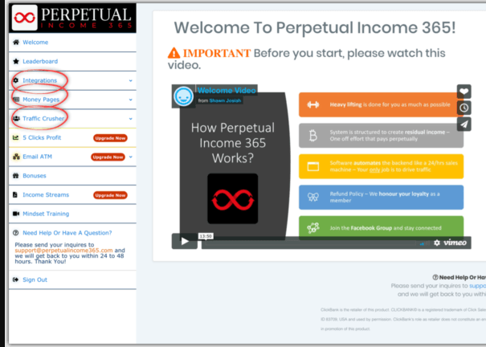

More businesses than ever are using affiliate marketing as a cost-effective way to reach targeted audiences. Annual spending in this industry is projected to reach $8.2 billion by 2022 in the U.S.

Affiliate marketing is marketing another company’s or person’s products or services and earning affiliate commission in the process.

It might sound simple, but it can get complicated.

Affiliate marketing is very competitive and profitable.

So Shawn Josiah created an automated system and called it [Perpetual Income 365](https://0c97crfjbm4l7veohj2ho01km5.hop.clickbank.net).

## What Is Perpetual Income 365?

Perpetual Income 365 is an automation system for affiliate marketing,

It is designed for those who don’t have the time or the knowledge to go through the whole tedious procedure to make money online.

It take care of the nitty-gritty details while still providing you with maximum recurring income.

It can increase affiliate sales through a unique approach to email marketing. But it will not bring out the traffic itself

## Perpetual Income 365 Explained.

If you opt for Perpetual Income 365, you will receive :

- two pre-designed squeeze pages.
- web hosting of these 2 pages.
- 31-day email follow-up sequence.
- instructions for solo ad traffic.

The two squeeze pages are websites with their own URL where visitors to the site can sign up.

The web hosting is necessary for your pages to go online. More precisely, web hosting is a space on a server that is available to your site.

By signing up, you will receive their email address and can use it for your email campaign.

The site visitor, on the other hand, will be redirected to the PI365 Revenue Generation Program page.

If they invest their money, you will receive 50 percent commission.

## How Perpetual Income 365 works?

**A. Account Creation And Linking**

- You will create an account at ClickBank.

- You will also need to register with GetResponse,

GetResponse is an email marketing service. All this is done with instructions, of course.

**B. Get the Money Pages**

Once the registration is done on both platforms, you can connect them to your PI365-Squeeze page with one click and you will receive the page URL, which you can then promote.

The goal of this squeeze page is to collect as much contact information - such as email addresses - as possible from people who are interested in your product.

**C. Traffic Source**

People who come to your site are called visitors. The people who also provide their contact details afterwards are leads.

You have to pay the costs for the traffic.

[Perpetual Income 365]([Perpetual Income 365](https://0c97crfjbm4l7veohj2ho01km5.hop.clickbank.net)) recommends several solo ad traffic services.

They cost between **$40 and $100 per 100 visits**.

**D. Get Paid**

The purpose behind your squeeze page is for a visitor to sign up and then be automatically redirected to the Perpetual Income 365 sell page.

When your lead makes a purchase, you automatically receive 50 percent of it as commission. At the same time,

## Perpetual Income 365 advantages

**Pros**

- good entry into affiliate marketing
- no previous knowledge necessary
- easily understandable
- Fast support via e-mail
- Facebook Group
- 60-day money-back guarantee

**Cons**

- Relies on solo Ads. which can be expensive.
- it is mandatory to use it in the context of the GetResponse program
- the costs are rather confusing at the beginning
- You are promoting PI365 itself to other people.

## Conclusion

Should you enroll? well. if you are trying to make a couple hundreds. YES. You can enroll in the program [here](https://0c97crfjbm4l7veohj2ho01km5.hop.clickbank.net). and start following the steps today.

but if you want to learn affiliate marketing and how to make money doing it. This is definitely not the way to do it.

An automated system is not how you do affiliate marketing nor how you learn it. if you'd like to become a digital marketer. you need to create your own pages. drive traffic and understand products. all of which can not be learned on an automated system.

Related Reads:

- [Introduction To Affiliate Marketing](https://digincome.com/affiliate-marketing/what-is-affiliate-marketing/)
- [How To Promote ClickBank Offers On Bing Ads](https://digincome.com/affiliate-marketing/clickbank-bing/)
- [How to Promote ClickBank Offers With FaceBook Ads](https://digincome.com/affiliate-marketing/clickBank-facebook/)
  <!-- https://0c97crfjbm4l7veohj2ho01km5.hop.clickbank.net/ -->
