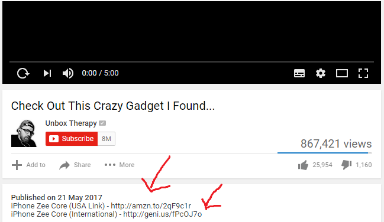

> An affiliate network acts as an intermediary between publishers and merchant affiliate programs. It allows website publishers to more easily find and participate in affiliate programs which are suitable. - [Wikipedia](https://en.wikipedia.org/wiki/Affiliate_network)

An affiliate network connects publishers, like blog owners or influencers, with companies looking to promote their products or services.

Amazon associates is an affiliate network, which allows publishers (AKA affiliates) to promote thousands of products and earn a commission for each purchase their readers or followers make.

## How do affiliate networks work?

To join an affiliate network, both advertisers and publishers must first sign up to the network. each network has its own rules and procedures.

**Advertisers** (Vendors) can add their programs to the network, once accepted.
affiliates will be able to promote the Vendor's product/service for a commission in return if they refer a buyer.

**Publishers** (Affiliates) can request approval for an offer (a program) they like to promote.

Once approved. a Publisher is given a referral link to be used in the website (YouTube, blog, instagram ...)

Affiliate programs always provide promotional materials about the product/service. Like Creatives , images, banners and sometime videos.

## Example of Affiliate Marketing

As you can see in this YouTube video description. 2 links are provided for the viewer to follow.

If the person watching the video likes this Gadget. and follows the link to buy it. the publisher (affiliate) will get a commission.

## Why An Affiliate Network ?

Advertisers (vendors) can approach or seek publishers directly to promote their products,

Using an affiliate network is generally more straightforward and secure. many aspects of running an affiliate program are handled by an affiliate network,

giving you more time to focus on other aspects of your business.

Benefits of using an Affiliate Network :

- **1. Managed Affiliate Solution**

Managing all aspects of an affiliate program can be difficult because there are so many variables involved.

Commission Rates. Accounts management, end-to-end tracking and ads-networks integration all provided by an affiliate network,

- **2. Advertising Budget Efficiency**

Advertisers typically pay a commission when a conversion is made (generally a sale), and this sale also triggers the affiliate network's fee,

This commission may not cover the publishers investement. and will result in a negative <abbr title="Return on Investment">ROI</abbr>

Most networks can be flexible with their payment models to ensure that the affiliate marketing channel is performing optimally.

- **3. Qualified Publishers**

Publishers must apply to join affiliate networks, and each advertiser program must go through an approval process.

Because not everyone is accepted, your products are only promoted by publishers who the network has identified as potential good partners for their advertisers.

Amateur publisher can hurt your product reputation by using spamming strategies and malicious schemes.

- **4. Sales tracking all in one place**

Affiliate networks provide you with a comprehensive dashboard that allows you to track impressions, clicks, conversions, and, most importantly, sales and revenue, and generate reports at any time.

You can keep track of which publishers are the most successful, as well as which campaigns are a success.

- **5. It Works**

With 81 percent of brands using affiliate marketing, it's clear that despite claims from across the digital industry that it's dying, this marketing channel is still growing in popularity.

The affiliate marketing industry now has over two decades of data to back up the simple fact that affiliate marketing through a dedicated network is a profitable endeavor.

## Top Affiliate Networks in 2021

**Niche** is usually the first criteria to look for. join the Network that provides affiliate programs in the niche you are promoting.

Not every network has a train your dog program and insurance companies offers. in the same place.

Once you narrow it down to a few. Here is what to look for.

- **Commission rates**: How much will you earn (pay if you are a vendor) per sale? Networks can vary widely.

- **Product/niche selection**: Will the network connect you with brands your audience will be interested in?

- **Approval requirements**: Some networks require your site to be well-established or have a certain amount of traffic to qualify as an Affiliate.

- **Other fees**: Some affiliate networks charge fees for training or setup.

- **Cookie duration**: Cookie duration refers to how long a program tracks and gives you credit for a prospective buyer. Durations can vary drastically from platform to platform. For example, Amazon’s cookie duration is 24 hours, while Avangate is 120 days

Now that you know what to look for — and what to avoid — let’s explore some of the top affiliate marketing networks.

- **ShareASale**

[Share A Sale](https://www.shareasale.com/info/). A Chicago-based affiliate network has been around since 2000. As an affiliate, you can connect with more than 4,000 programs and earn commissions on a wide range of products, including Reebok, Cricut, and Etsy.

- **Awin**

[Awin](https://www.awin.com/us) is a global affiliate network platform with access to more than 15,000 advertisers, and they helped generate more than 150 million in sales in 2019 alone. It’s also worth noting they own several other affiliate networks, including ShareASale, though those networks have their own sites.

- **Amazon Associates**

Probably the best-known affiliate network is [Amazon Associates](https://affiliate-program.amazon.com/). As the largest e-commerce store globally, Amazon provides access to millions of products from baby gear to home goods, makeup, and much more.

- **CJ Affiliate**

Formerly known as Commission Junction, [CJ Affiliate](https://www.cj.com/) is one of the world’s largest and oldest affiliate marketing networks. They connect merchants with more than 14 billion readers annually and help affiliate marketers earn more than $1.8 billion every year.

- **Rakuten Advertising**

Founded as a Japanese e-commerce brand, [Rakuten Advertising](https://rakutenadvertising.com/) is home to one of the top affiliate marketing networks. They provide affiliates access to hundreds of top brands, including Wells Fargo, Lilly Pulitzer, Virgin Holidays, and Ecco.

- **ClickBank**

[ClickBank](https://www.clickbank.com/) is a global affiliate marketing platform providing access to a wide range of products you can promote, including physical and digital ones.

Overall, ClickBank is easy to join and provides access to a wide range of products. It is the most popular because of it's straight forward and easy website.

They also have a good training program called ClickBank University.

> There are more Networks we did not cover in this article like MaxBounty, SmartAdv, Digistore24 and more

## Conclusion

One of the most effective ways to monetize your blog is through affiliate marketing.

An affiliate network makes connecting with merchants much easier, allowing you to focus on what you do best: creating great content.

**For Affiliates**

- Join an affiliate network.
- Apply for an offer that your audience like
- Talk about it. and include your Referral Link
- Get Paid Whenever someone buy through your link

**For Advertisers (Vendors)**

- Join an affiliate network.
- Submit your product/service to the network
- Provide materials for your product. Photos, Discounts, Leads
- Affiliate network will track commissions, refunds, sales for you
