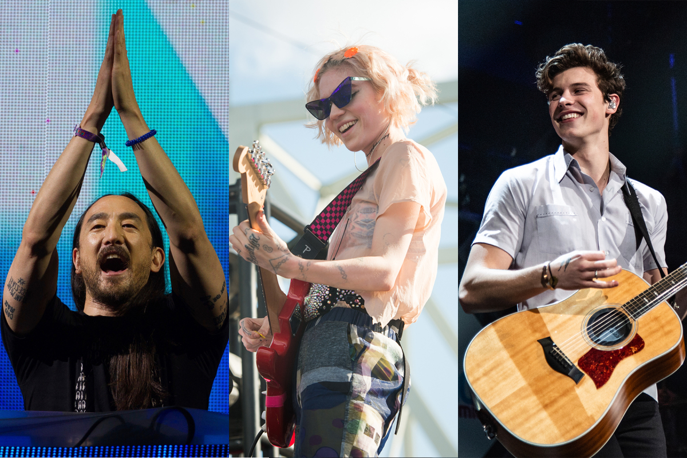
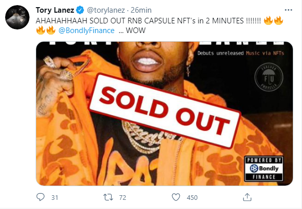
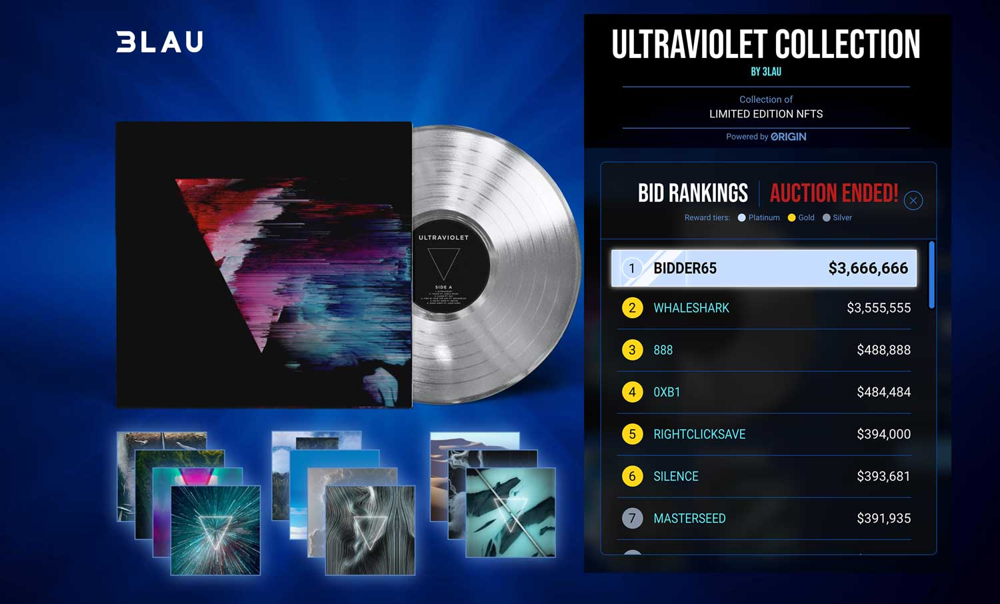
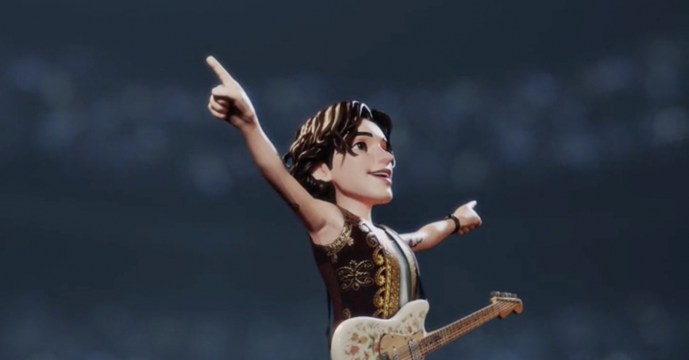
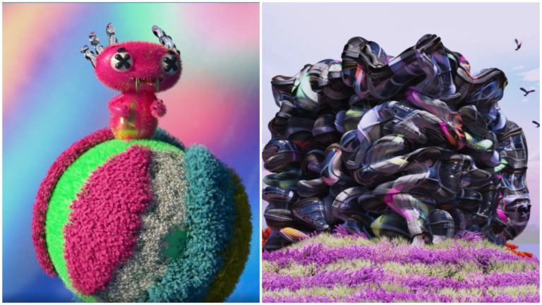
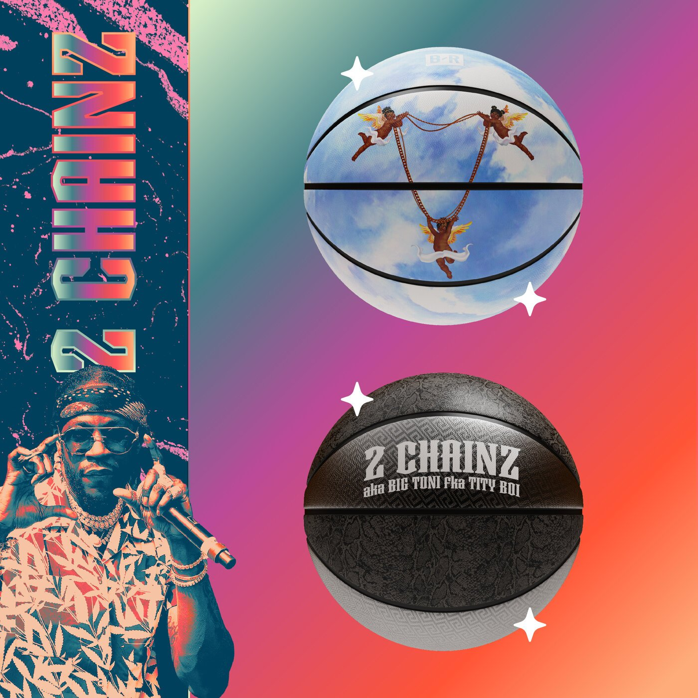

we covered in a [previous post](https://digincome.com/nfts/steve-aoki-nft/) how Steve Aoki released a limited art collection. The event brought in $4.25 million. Last week, <strong> Kings of Leon </strong> became the first band to a release a new album as a non-fungible token (NFT) — and a representative tells Rolling Stone that the band has already grossed more than $2 million in sales,

Hours before that, Tory Lanez released three new tracks as NFTs. Two of the songs came from his new album, Playboy, which arrived 10 hours later, and one is from his not-yet-named Eighties-themed album. in a collaboration with Bondly.Finance. they created 450 song NFTs.
<strong > The tokens sold out within two minutes. </strong> Lanez’s collection earned a record $500,000, including resales, in the first 24 hours, a representative tells Rolling Stone.

But the wave was forming before Lanez and Kings of Leon caught up. During the week of February 15th, Linkin Park’s Mike Shinoda became the first major-label artist to release a single as an NFT. His “Happy Endings,” featuring Iann Dior and Upsahl, went up for auction via an NFT marketplace called [Zora](https://zora.co).

10 tokens were created, housing a 75-second clip of the song set to animated artwork by Shinoda and contemporary artist Cain Caser, Input reported. The “#1 of 10” token, for example, ended up selling for five WETH which equates to somewhere around $8,000 USD.

The next week, a popular DJ named 3lau made history with the very first album-holding NFTs. In rereleasing his 2018 album, Ultraviolet, in this format, he made close to $12 million in 24 hours. Starting February 25th, fans had 72 hours to bid on his 33 NFTs.

Winners were then able to redeem those for special-edition vinyls, unreleased music, unique experiences, and bonus-song NFTs, according to a press release.

“I’m beyond excited to present the first tokenized album on a direct-to-collector platform built by Origin Protocol,” 3lau said in a statement at the time. “This marks a major turning point in the NFT space; creators will have maximum flexibility in issuing digital assets to fans.”

When 3lau’s auction came to a close on February 28th, one hosted by Grimes was just beginning. Within minutes of her auction opening, the price on one piece of audiovisual artwork called “Death of the Old” — containing a demo of unreleased song “Anhedonia” — surpassed a value of $100,000.

the whole collection earned close to six million dollars in 20 minutes — and “Death of the Old” finally sold for around $400,000 by the auction’s end.

That same weekend — and on the same online marketplace that Grimes used, Nifty Gateway — Latin star Ozuna unveiled his first collection of NFTs. There, Ozuna uploaded 15 identical “Ositos” NFTs that reimagined his traditional logo and used 19 seconds of lyricless audio.

A source on Ozuna’s team says the work generated more than $456k in in 15 minutes.

While Ozuna watched his NFTs trade on, a company called Genies, which creates 2D and 3D avatars of celebrities, kicked off a partnership with Shawn Mendes, wherein they’d release collectible and wearable accessories for said avatars in the form of NFTs. Mendes agreed to donate all of his proceeds to The Shawn Mendes Foundation Wonder Grants,

The Genies representative says the drop announcement lead to the “highest amount of traffic [OpenSea](https://opensea.io?ref=0x008d8c1adf0ece93d7a4464854c50590e0c3f0db) has ever experienced,” adding that transactions are already happening on the secondary market “where people are selling the Genie Moments/digital goods for $6-8k when they bought for hundreds of dollars.”

Then came the Kings. But Steve Aoki wasn’t far behind. On Sunday, March 7th, the celebrity DJ unleashed on Nifty Gateway 11 original pieces by Antoni Tudisco, a digital artist known for his particularly trippy visuals. There were three tiers: For the first, eight of these NFTs were priced at $2,000. Two others named “Character X” and “Run” were priced at $2,500 and $5,000, respectively. In the time that the sale was open, 618 “Character X” tokens were minted, and 280 “Run” tokens were minted, meaning that Aoki generated close to three million dollars with these two tokens alone.

The final one-of-one piece went up for auction, closing at $889,000 by Monday afternoon. (With a little more than an hour left, it rose chaotically from $151,000 to $425,000 — before skyrocketing in the last 30 minutes or so.) All tokens considered, sources at Nifty Gateway told Rolling Stone on Monday night that Aoki had generated a little more than $4.2 million.

Aoki’s launch weekend also happened to be NBA All Star Weekend, for which hip-hop stars Quavo, Lil Baby, 2 Chainz, and Jack Harlow collaborated with Bleacher Report on an NFT collection on OpenSea.

“The 3D digital models will feature four custom-designed basketballs that mix music, culture and sport with innovation,” there were two tiers: gold and silver. Each artist got their own silver-edition NFT, of which 150 were minted. Those were sold for a flat price of .4 ETH, which is worth about $715 USD at press time. The artists also each got their own gold-edition NFTs, presented as “10 of 10” and put up for auction.

those tokens had collectively sold for more than $591k. Together, gold and silver tokens generated around $903,000 over the weekend. As of press time, 2 Chainz had the highest-priced sale with his gold “#1 of 10” going for 38 ETH ($68,030 USD).

