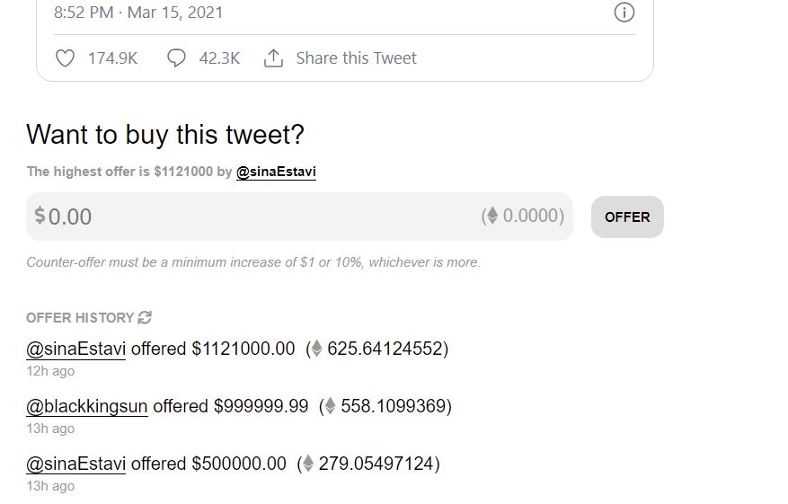

<blockquote class="twitter-tweet">
I’m selling this song about NFTs as an NFT <a href="https://t.co/B4EZLlesPx">pic.twitter.com/B4EZLlesPx</a>
&mdash; Elon Musk (@elonmusk) <a href="https://twitter.com/elonmusk/status/1371549960030842893?ref_src=twsrc%5Etfw">March 15, 2021</a></blockquote>

Bidding for Musk's tweet, which features a video and song about NFTs, has a top bid of $1.1 million. Tesla CEO Elon Musk speaks during the unveiling of the Tesla Model Y

According to the auction on [Valuable By Cent](https://v.cent.co/), the tweets marketplace holding the auction, the highest bidder will receive “a digital certificate of the tweet, unique because it has been signed and verified by the creator.”

First major bid at 279 ETH -$500,000.00- by [@sinaEstavi](https://twitter.com/sinaEstavi) did not stay for long and the outbid for 558 ETH -$999,999.99 came from @blackkingsun . and then came the highest bid at the time of writing by [@sinaEstavi](https://twitter.com/sinaEstavi) Again.

<blockquote class="twitter-tweet">
Hey <a href="https://twitter.com/elonmusk?ref_src=twsrc%5Etfw">@elonmusk</a> I made an offer to buy your tweet:<a href="https://t.co/shc7argiK5">https://t.co/shc7argiK5</a> <a href="https://t.co/xwUSRdqjuP">https://t.co/xwUSRdqjuP</a>
&mdash; Estavi ([@sinaEstavi](https://twitter.com/sinaEstavi)) <a href="https://twitter.com/sinaEstavi/status/1371622086943330304?ref_src=twsrc%5Etfw">March 16, 2021</a></blockquote>

The auction winner will also get the metadata of the original tweet, including “when the tweet was posted, what the text contents are of the tweet, the timestamp of the tweet, and the digital signature from the creator’s crypto wallet address.“ The listing does not currently have an end date.

Twitter CEO Jack Dorsey is also selling one of his tweets as an NFT — bidding has reached $2.5 million.

Note that the highest bid in both NFT auctions for Musk’s and Dorsey’s tweets are held by the same Twitter user, [@sinaEstavi](https://twitter.com/sinaEstavi).

## Beginners Guide To NFTs And Crypto Art

NFTs have exploded in popularity in recent months as people have spent hundreds of millions of dollars on digital assets like NBA Top Shot and other digital art. One piece of digital art by the artist known as Beeple sold recently sold for $70 million.

If you are new to the NFTs market. i would advise you to read the following
Begginers

- [Why You Should Get Into NFTs](/nfts/get-into-nfts/)
- [How to create an NFT ? NFT Minting](/nfts/how-to-mint/)
- [How To Find Good NFTs](/nfts/valuable-nfts/)
- [How To Start NFTs 📈](/nfts/how-to-start)
