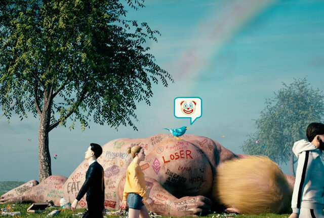
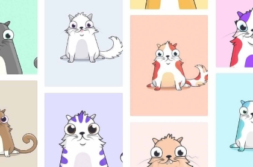
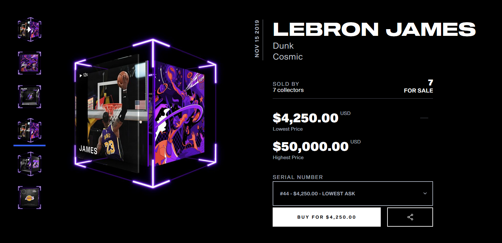

Now that you know what <a href="/nfts/what-is-nft/"> NFTs </a> are. it is time to start digging and get familiar with the market. in this short article i will show you how much people are willing to spend for an Original art. and why it concerns you.

## NFT market is on fire

First, let me tell you that the market is on fire. Someone paid almost $390,000 for a <a href="https://niftygateway.com/itemdetail/primary/0x948b3515d81034a3c16d5393c6c155946c93c103/1" target="_blank"> 50-second video by Grimes</a> . another person paid $6.6 million for a video by Beeple. yes ! 6.6 Million Dollars for this

The work, titled CROSSROADS, was created by Beeple considering the 2020 US Presidential elections.a dummy figure resembling Trump lying naked on the sidewalk. On its body, one can view various terms and phrases like ‘loser’, ‘MAGA’ and ‘drink bleach’.

The artwork is NFT (or non-fungible token) – which means that the original copy cannot be copied or counterfeited in any possible way. In the world of digital art, Beeple is a well-recognized name. Just in December last year, his sales over the weekend accounted for $3.5 million. This, despite the fact that the artist rarely offers his works for auction.

The buyer interest in NFT has reached new heights over last year. The NFT Report 2020 said that the year saw a total of $250 million worth of NFT being sold.Most works at the Nifty Gateways auction were bought within few minutes of the auction <strong>and then re-sold sometime later at inflated prices</strong>.

## What’s the point?

Depends ! maybe you just like having unique things. but first let me ask you

## Are you an Artist ?

You might be interested in NFTs because it gives you a way to sell work that there otherwise might not be much of a market for. if you are an Artist with a big audience. chances are higher that you can create NFTs and sell them. if you have an Engaging Audience. traders like me might buy your digital art and resell it. it is a win-win situation.

Also, NFTs have a feature that you can enable that will pay you a percentage every time the NFT is sold or changes hands, making sure that if your work gets super popular and balloons in value, you’ll see some of that benefit. Passive Income Baby !

<blockquote class="twitter-tweet">
She explained it better in 1m than I could in 2K words 😅 <a href="https://t.co/sJ7Z7NjWH0">pic.twitter.com/sJ7Z7NjWH0</a>
&mdash; Robert Martin (@Brotractor) <a href="https://twitter.com/Brotractor/status/1367527790728257536?ref_src=twsrc%5Etfw">March 4, 2021</a></blockquote>

## Are you a Buyer ?

Buying art lets you financially support artists you like just like buying Merch. but buying an NFT also usually gets you some basic usage rights, like being able to post the image online or set it as your profile picture. Plus, of course, there are bragging rights that you own the art, with a blockchain entry to back it up.

## Oh. You're a Collector

well the NFT world might be the best for you because of the variety. NFTs can work like any other speculative asset, where you buy it and hope that the value of it goes up one day, so you can sell it for a profit.

## There is only one ?

technicaly.every NFT is a unique token on the blockchain. But while it could be like a van Gogh, where there’s only one definitive actual version, it could also be like a trading card, where there’s 50 or hundreds of numbered copies of the same artwork.

## Someone is willing to pay thousands for it ?

Absolutely. to some people . NFTs are the future of fine art collecting. others treat them like Pokémon cards. and if there is someone willing to pay for it. there is a guy like me and you taking the opportunity to Trade and make profit.

## Famous Collectibles

Sheldon Corey from Montreal, Canada, told CNBC he paid $20,000 for one of thousands of computer-generated avatars called CryptoPunks.

<strong>CryptoPunks</strong> was released by developers Larva Labs in 2017. But it’s boomed in popularity lately, generating $45.2 million in sales volume in the last seven days alone according to the website NonFungible, and inspiring a broader “crypto art” movement.

<strong>CryptoKitties</strong> one of the original NFTs, generated $433,454 in sales in the past week, according to NonFungible. The digital cats, which were developed by a start-up called Dapper Labs, were once so popular they clogged up the network of digital currency ether.

<strong>NBA Top Shot</strong> a platform created by Dapper Labs in partnership with the basketball league, attracted $147.8 million in sales in the last seven days,The service lets users buy and sell short clips showing match highlights from top basketball players.

## Are you hyped enough ?

well. now that you have seen how much money people are making on NFTs. i advice you to get in. not buying or selling right away. but at least login.

to start trading NFTs You need ETH and an ethereum wallet to get started. The most common is Metamask.io - then you add some ETH into that wallet. This is required by all sites in order to interact with an Ethereum application.

## Conclusion

Get into NFTs Now! call it crypto art or whatever you like. just Get in. Now. go get that ethereum wallet on Metamask.io and checkout the market. If you are lost on how to start trading. check out this article. <a href="/nfts/how-to-start/"> How To Start NFTs </a>

