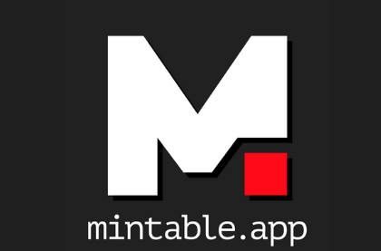
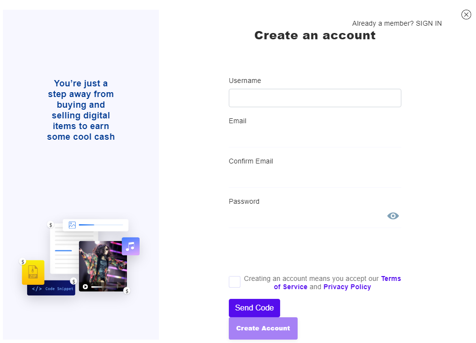
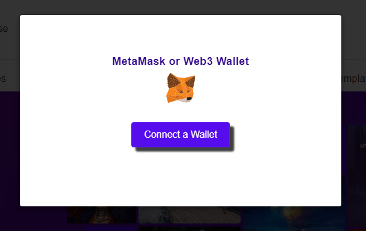
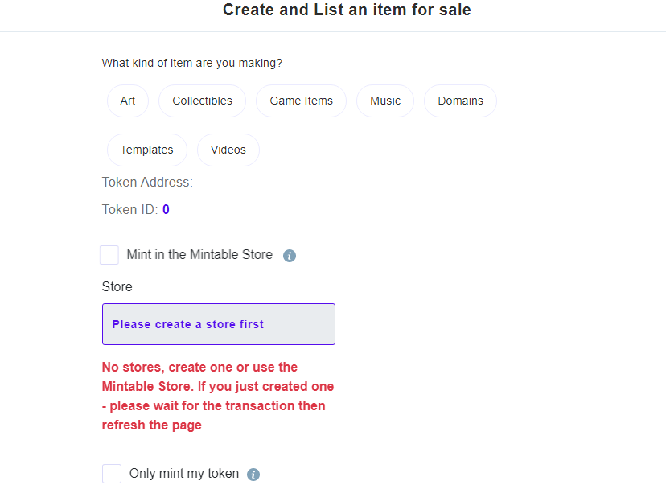
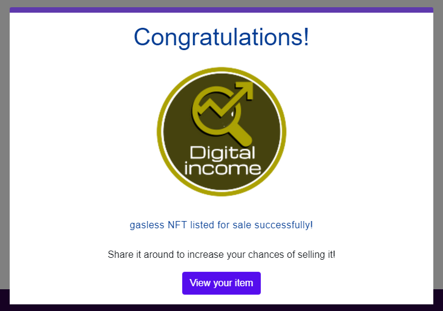
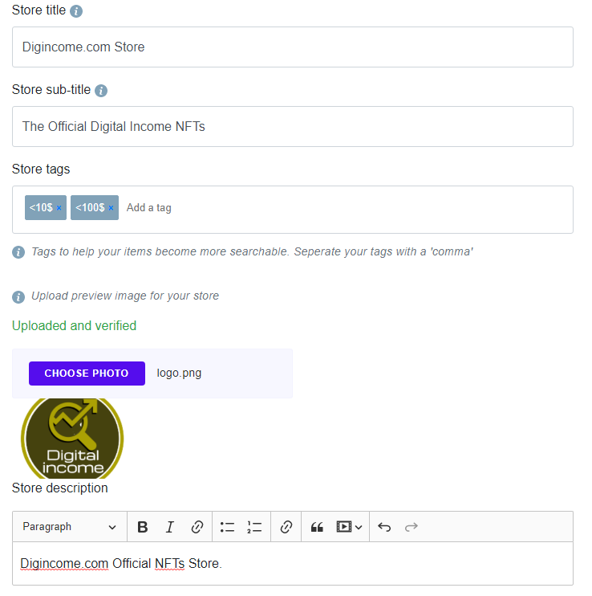
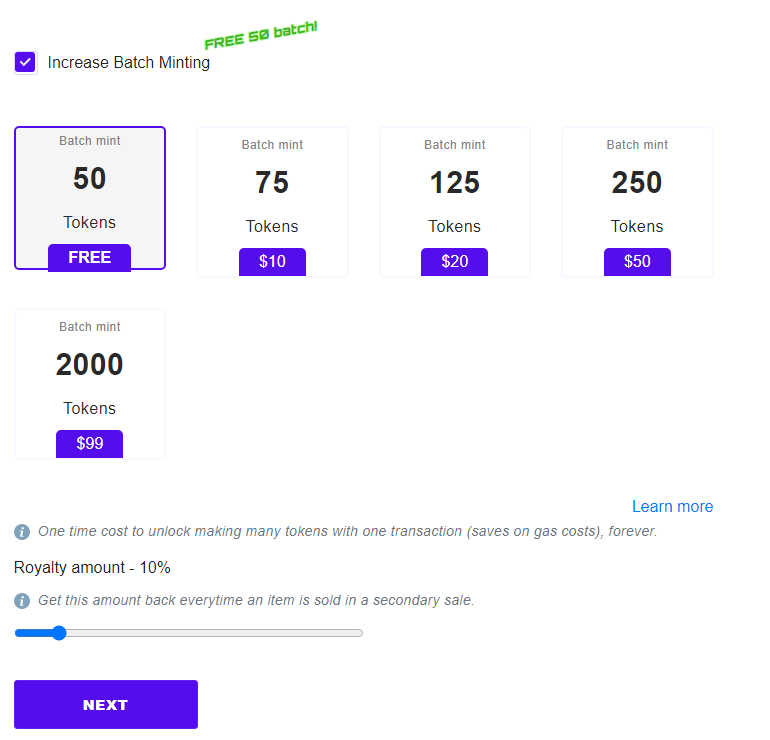
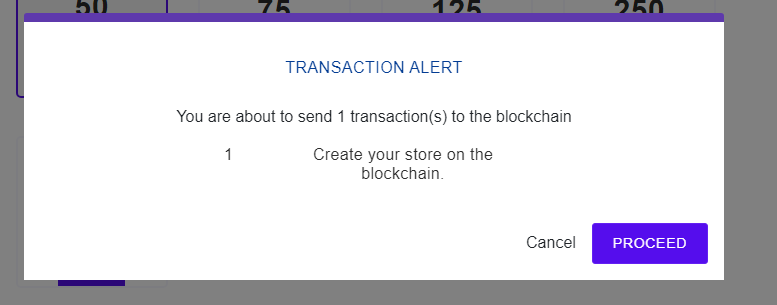
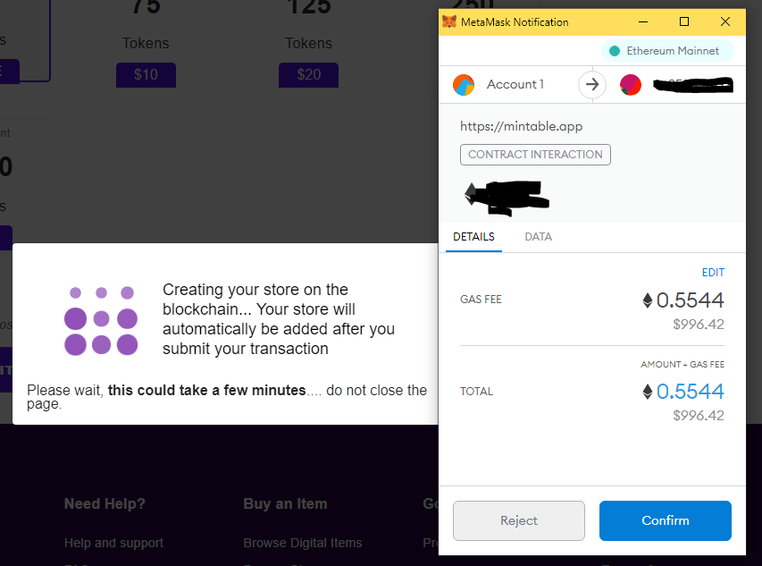

We want to live in a world where digital creators have solid options for monetizing their incredible work. Thanks to the internet, an artist can upload, share, and get thousands of likes for a digital artwork and get paid what he's worth !

## How do I get started minting NFTs?

> <strong>Mintable.app</strong> is the most flexible and has the most possibilities so we will be using it as a beginner guide.

whether its artwork, graphic designs, 3D models, videos, PDF, research , anything digital - it can all be turned into an NFT using platforms like Mintable. If you are a content creator i advise you to start on Mintable. there are many other platforms but it is beginner friendly.

> ## Creating an account

Go to the [mintable](https://mintable.app/) website and create an account.

once you are done you need to connect your wallet. if you do not have one yet. go with [MetaMask](https://metamask.io/) it is the best because of the chrome extension.

once you are logged in you can start Minting. but first let's see the options provided when you choose to mint:

- Mint in Mintables store
- Gasless minting
- Your own store

## Mint in Mintables store

Mintable says: You don't need to create a store - which saves you money - your item will be inside the Mintable store contract.

Selecting this option allows you to use <strong> Mintable's store for free </strong>, and can mint thousands of NFTs in a single transaction doing so. This is one of the reasons Mintable.app is the most flexible platform for creating NFTs.

## Gasless Minting "Free"

You are able to mint directly on Mintable's store without needing to submit a single transaction, meaning no transaction fees from the blockchain.

This is the best way to get started and test the NFTs. try it here https://mintable.app/gasless

i created the first Digincome Logo as a test NFT. for free.

checkit out [here](https://mintable.app/art/item/gasless-NFT-no-subs-yo/N_D-01VtDDViN_H) and
notice how my item is listed on a store called "Mintable Gasless store"

## Your own store:

> ### This is the recomended option for Artists $.

After you are done playing with gasless minting. you can start creating your NFTs and listing them on the "Mintable's Store". but you need to work on your Brand !

You should create your own store, Doing so means that you have a store (contract on the blockchain) that you own, you control, your the only person who owns it. This is the preferred method for creating NFTs but there is a catch.

Deploying a smart contract COSTS you money. Around $960 (At The Moment) initial investment to deploy the smart contract. but after that, you can mint hundreds of NFTs for as little as $90 using Mintable's batch minting. (there is a free )

> Take your time to fill in your store information and give it a good description

> Checkout out the Increase Batch Mining. it's cheap and a good start

> Mintable will prompt you for a confirmation throught MetaMask Extension. it shows how many transactions you are about to send to the BlockChain.

> If you'd like to save some backs. click Edit on the gas. and choose the Slow Transaction. And click Confirm to proceed with your payment

> ## Now That You Own An NFTs Store. Time To Start Minting !

now Minting an item is nothing more then picking a store. uploading the file. and filling the form.
take your time to read the fields and requirements. Mintable has made it so clear and easy that we do not really need to go through all the options you have.

You can create your title, the subtitle, add a description (make it good and tell a story behind your NFT!)

Once you click sell - you will be taken to a page to create your listing for your NFT and the mint it on the blockchain. Its very similar to listing an item for sale on ebay, etsy, or amazon.

#### Uploading your content

Mintable has huge file limits, 3gb for the private unlockable file, and 200mb for the preview images.

This is great as it means you can upload huge 4k mp4s, high res photos, zip files, or more.

#### Unlockable private file

This file is a private file that ONLY the current owner of the NFT can access, so if your selling a video NFT, you may upload a low res, short clip as the preview image that anyone can see - but once a buyer purchases your NFT, they can download the full, 4k resolution video.

#### Preview images

You then can upload the image for the NFT itself, and the preview images for the listing. The first image you upload is the NFT image that shows in wallets, and the other images are shown on the listing page. Think of it like Amazon, the first image is the image people see when browsing amazon, and the other images are the extra images shown when they click on the item page.

Set your price for the item, select a few other options like transferring copyright or making it non-resellable, and then list it for sale!

After your transactions are submitted thats it, you just created an item on the blockchain that you own, you control, and you can sell. Congrats!

## Conclusion

Creating NFTs on Mintable is made so easy. Its very similar to listing an item for sale on ebay, etsy, or amazon. here is a Recap.

- Create an account on [mintable](https://mintable.app/)
- Link Your Wallet. [MetaMask](https://metamask.io/) is best
- Create one Gasless (free) NFT. as your first Test
- If you can afford it . Create Your Store (you should. You have to stand out from the crowd)
- Select Your Store (you can start with Mintable's Free Store )
- Take your time to create a description for your NFT. make it a story
- Start Selling ! Link to your store (or NFTs) on your twitter. instagram. Everywhere

I hope you get your first NFT sale as soon as possible and feel the hype !
if there is anything left i did not cover. please mention in the comments. if you need more information about some topic. leave a question. and do not forget to subscribe to our news letter. Do Not Miss NFTs News !
