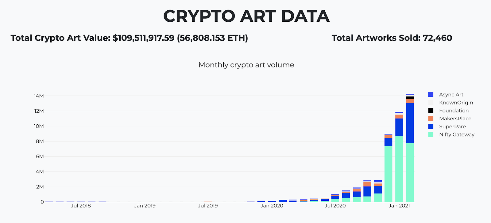
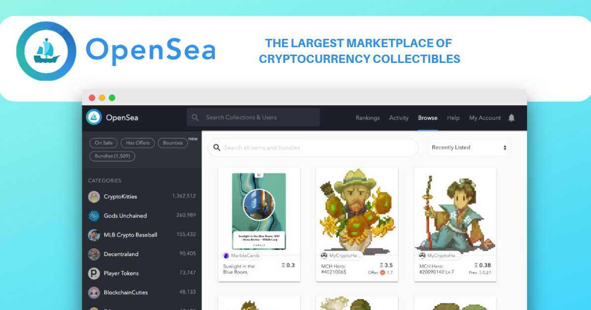
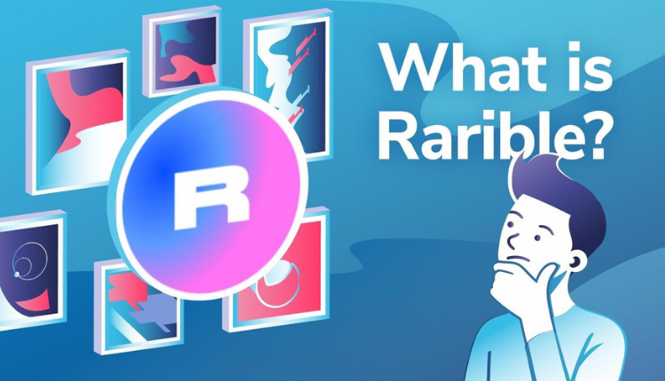
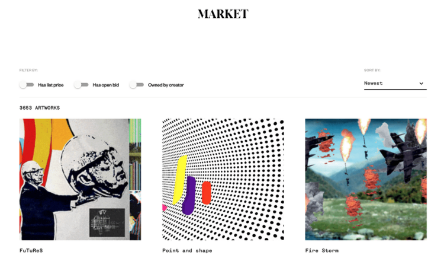
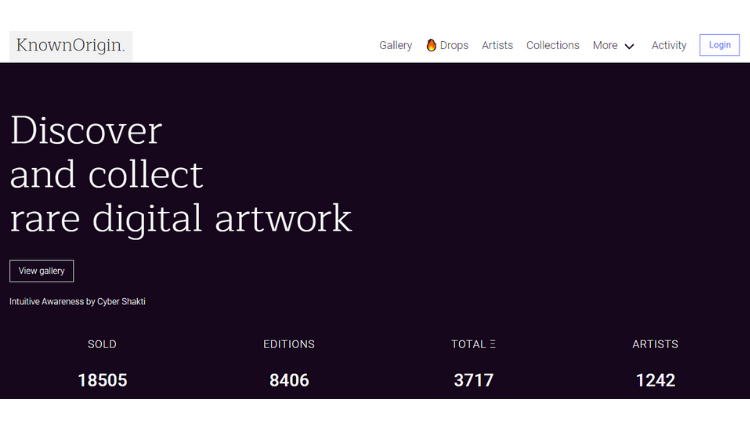
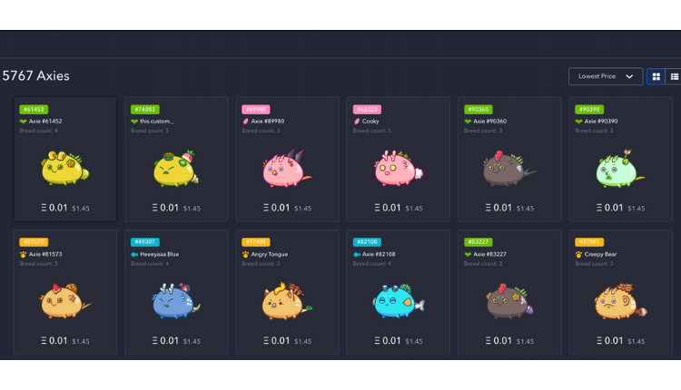
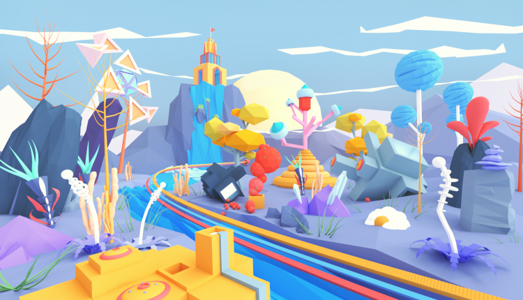

Platforms like Nifty Gateway, SuperRare, Foundation and Zora are quickly emerging as the leading players for creatives to monetize work in a digital world.

The estimated total value of crypto art has now passed $100 million according to cryptoart.io/data — just one vertical of a growing ecosystem of NFTs.

## Why do i care ?

<!-- “NFT”  -->

Well i consider this as the new wave of bitcoin. this time i will make sure i ride along. have you ever heard of Air-drops ? imagine that some people got Bitcoin from air drops . how ? because they were following the news ! unlike me and maybe you, they did not buy bitcoin but they had crypto wallets open. subscribed to many news and blogs. and when new cryptocoins emerged, they usually start with airdrops. and then you can take whatever share you had and convert it to bitcoin or keep it as is. my point is “Stay Updated even if you are not willing to spend money at the moment”.

NFTs have exposed a creative side of crypto that is not only fun to play, but digestible and accessible to new users. As bigger names host their first NFT drops, they bring a new wave of attention to their millions of followers noticing crypto for the first time.

If you are not convinced yet. Read my previous article here and you will realise how much money is rolling in NFTs. then come back here to start.

## how to start buying/selling NFTs

to start trading NFTs You need ETH “Ethereum is the second biggest cryptocoin after Bitcoin” and an ethereum wallet to get started. The most common is Metamask.io .You add some ETH into that wallet. This is required by all sites in order to interact with an Ethereum application. and you just find the market place of your choice. let's talk a little about markets and the MetaMask wallet.

## MetaMask 🦊

A crypto wallet & gateway to blockchain apps. MetaMask is an extension for accessing Ethereum enabled distributed applications, or "Dapps" in your browser! there is also a mobile version for both iOS and Android.

MetaMask also lets the user create and manage their own identities (via private keys, local client wallet and hardware wallets like Trezor™), so when a Dapp (MarketPlace) wants to perform a transaction (buy/sell) and write to the blockchain, the user gets a secure interface to review the transaction, before approving or rejecting it.

So when you are on the market, ETH is your currency, and MetaMask is your wallet. and also it is your Login method. no more sign up shit. this is why we all love MetaMask. so go get yourself one [here](https://metamask.io/download.html).

## NFTs Markets

There are several marketplaces that have popped up around NFTs, which allow people to buy and sell. These include OpenSea, Rarible, and Grimes’ choice, Nifty Gateway, but there are plenty of others.

- <strong> [OpenSea](https://opensea.io?ref=0x008d8c1adf0ece93d7a4464854c50590e0c3f0db) </strong> -The first and biggest peer-to-peer NFT marketplace for crypto goods. You can think of it as eBay on the blockchain. my personal favorite i am always there spying on new items and recent purchases. Items available include collectibles, game items, and other virtual goods secured by a blockchain.you can buy, sell, and trade any of these items with anyone in the world. you should check the it out [here](https://opensea.io?ref=0x008d8c1adf0ece93d7a4464854c50590e0c3f0db)

- <strong> Rarible </strong>- similar to sites like OpenSea. It’s also a platform for creating NFTs. You can go to Rarible with content you own such as a digital image or motion graphic and create an NFT and sell it. you can create multiple NFTs for one single image and sell it a multitude of times. Or, instead, distribute just a single item which is then deemed Rarer. Furthermore, you can set a percentage to receive on lifetime re-sales.

Buyers can purchase NFTs and build a portfolio. Some are building personal portfolios of what they personally like, whilst others are building a collection of art they see future value in.

- <strong> SuperRare </strong>- SuperRare is a social platform that encourages the creation and collection of crypto art. Founded by John Crain, Chief Executive of Pixura, and Jonathan Perkins, Chief Product Officer of Pixura. SuperRare has worked with artists since its conception and makes a point of listening to the artist and collector’s needs.

It could be argued that SuperRare is the high end equivalent to Rarible. Entry barriers are higher and artists must submit their works for approval before they are listed. Whereas on rarible, anyone can get involved.

- <strong> Known Origin </strong>- Known Origin empowers artists & designers to create, discover and own rare digital artwork all secured by the Ethereum blockchain. Artists can submit digital artwork as a jpg or Gif to the KnownOrigin gallery. All files are held decentrally on IPFS. All assets are given unique identifiers that can be tracked.

Known Origin <strong> focuses on digital art</strong> so there is no point going here to look for Cryptopunks or Avastars for example. Think of the items on sale here as you would those at an art gallery.

- <strong>Axie Marketplace</strong> Axie Infinity is a Pokemon-inspired digital pet universe where players use their cute characters called Axies in various games. The Axie Infinity Universe highlights the benefits of blockchain technology through a “Play to Earn” gameplay model and a player-owned economy.

Over time, the price can go up or down from the start price to the end price, depends on the seller’s intention. Other players have to be well-calculated to take the chance to buy the desired Axies from sellers.

- <strong> Decentraland Marketplace </strong> -Decentraland is a decentralized virtual reality platform powered by the Ethereum blockchain. Within the Decentraland world, users can create, experience, and monetize what they build and what they own.

In the shared virtual world users can buy land, known as “parcels” that are recorded on a blockchain backed ledger. The land itself, as well as the virtual properties built on top of it, is a type of a non-fungible digital asset or utility token called LAND, which is stored in an Ethereum smart contract.

LAND owners control the content published on their land, which is coded into a smart contract. This content could be anything from scenes and images to games and applications. Users can explore, travel, and visit venues in a similar way to in the real world. The platform is also a peer-to-peer network for users to interact.

> ## there are a lot more NFTs markets, each one has it's own taste like Viv3 ,TreasureLand, NFT Showroom, Arkane Market, Ghost Market and more

## Conclusion

a conclusion ? what are you waiting for. go get your MetaMask wallet. and start exploring the [OpenSea](https://opensea.io?ref=0x008d8c1adf0ece93d7a4464854c50590e0c3f0db) . there is nothing more to it . it is so simple. if you still have something on your mind that needs clearance. do not hesitate to ask in the comments. i will personally answer your question if i can.

if you are hesitant on how to pick an NFT. read this article here that will show you what and how people are speculating prices and how you can make money trading NFTs.
