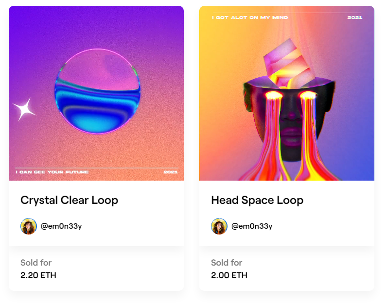
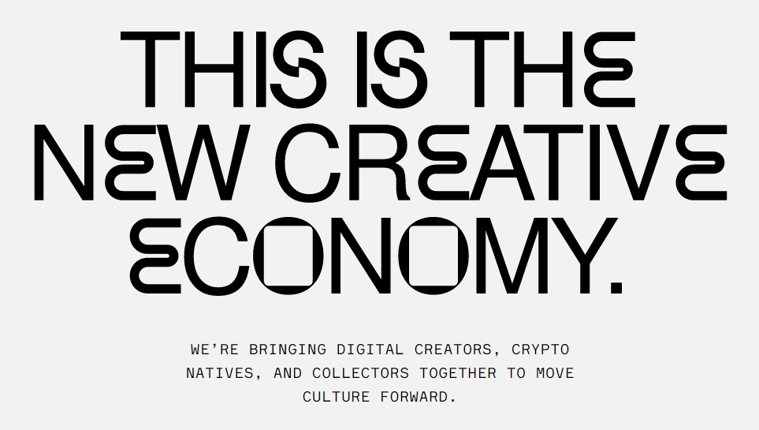
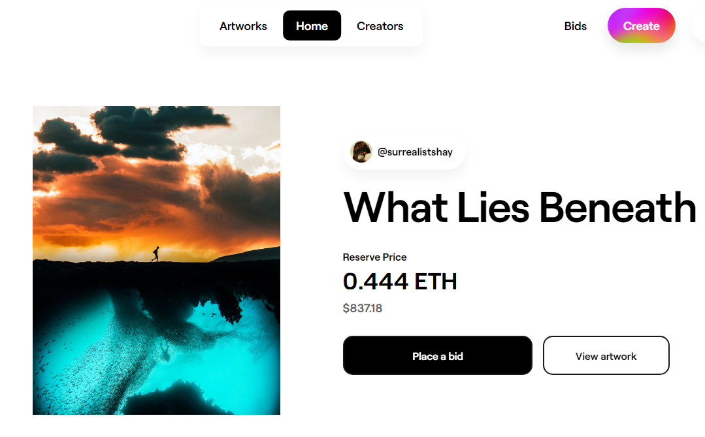

"Artists are always looking for ways to make money off of their work," Maloney says. "Once the word got out on crypto art, the gold rush really began."

Meet [@Em0n33y](https://twitter.com/Em0n33y)

she sold her cryptoart in less than 24 hours for 3000$ !

<blockquote class="twitter-tweet">
She explained it better in 1m than I could in 2K words 😅 <a href="https://t.co/sJ7Z7NjWH0">pic.twitter.com/sJ7Z7NjWH0</a>
&mdash; Robert Martin (@Brotractor) <a href="https://twitter.com/Brotractor/status/1367527790728257536?ref_src=twsrc%5Etfw">March 4, 2021</a></blockquote>

if you go to the Foundation.app and look her up in the Creators section. you will see the 2 art she sold at the moment of writing this article.

## NFTs Are Fueling a Boom in Digital Art.

This is the new creative economy. where digital creators have solid options for monetizing their incredible work. and if you think [@Em0n33y](https://twitter.com/Em0n33y) $3000 cryptoart is good money.

Meet [☆Chris☆](https://foundation.app/NyanCat) @nyancat

"Nyan Cat is the name of an animation uploaded on April 2 2011, and became a viral internet sensation. The design of Nyan Cat was inspired by my cat Marty, who crossed the Rainbow Bridge but lives on in spirit." Chris.

Nyan Cat, sold for 300.00 ETH (about $590,000) in an online auction
on the same platform.

## Foundation Market Place

There are multiple platforms to sell NFTs of all types from memes to tweets. ranging from $1 to $6 million dollars. but for Visual Artists. Foundation is one of the Best platform for one reason:

> ## Right now, Foundation is available for artists by invitation only.

Do not think of this as a stepback. No no no this actually gives Creators more credibility and visitors more trust. this is like the a VIP Club for creators.

the website says "Foundation is curated by the creators in our community. We may open up more broadly depending on the community’s feedback."

"If you’d like to become a creator, join our Discord and share your work in the #intros-invites channel."

## Conclusion

If you are an Artist. i advice you to head to the [Foundation](https://foundation.app/) website right now. Take a look at what kind of graphics and creations people are posting. This is the home page i got at the time.

Now join the discord and start showing your work ! right now ! and wait for that invitation to start selling.

In the mean time you can read :

- [How to create an NFT ? NFT Minting](/nfts/how-to-mint/)
- [Why You Should Get Into NFTs](/nfts/get-into-nfts/)
- [How To Find Good NFTs](/nfts/valuable-nfts/)

<!-- Right now, Foundation is available for artists by invitation only..

Foundation is curated by the creators in our community. We may open up more broadly depending on the community’s feedback. If you’d like to become a creator, join our Discord and share your work in the #intros-invites channel. -->
