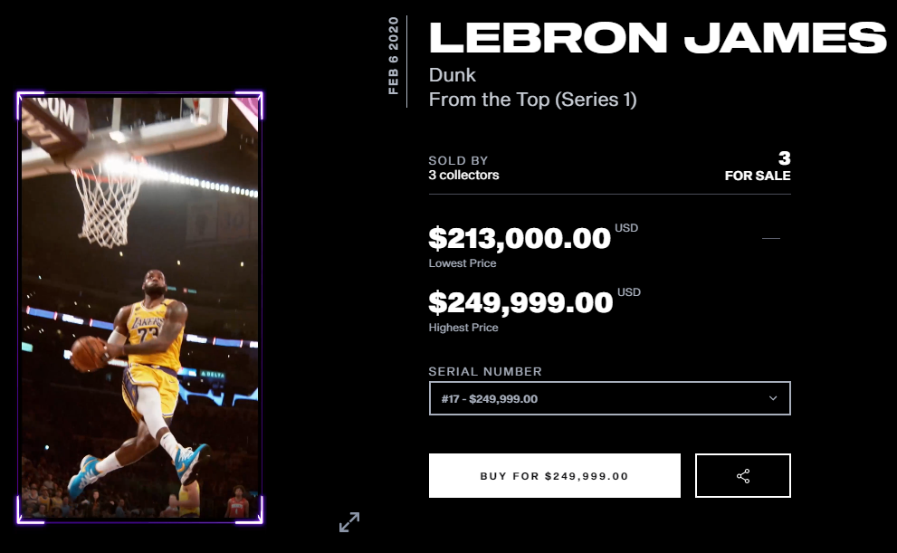

> Disclaimer: This is not an investment advice or investment recommendation nor does it constitute an offer to buy or sell.

In the context of the stock market, speculation refers to buying shares of a specific company in hopes that the shares will rise in price, allowing the investor to sell them for a profit.

NFTs can be considered the same thing. the main difference is the knowledge base. you may not know when a stock price will sky rocket . Wall street guys have access to much more stats and knowledge so they know better. right ?

Well. when it comes to NFTs. we have a lot more information and statistics available. let's see the Logan Paul case.

## Logan Paul Sells $5 Million Worth Of NFTs

Paul partnered to create and distribute the NFTs with a company called Bondly. The set of 3,000 NFTs dropped on Feb. 19, with each selling for 1 ETH. During their first day on the market, 1,772 NFTs were purchased — with ETH being valued at roughly $2,000 at the time — for a total of roughly $3.5 million in sales.

The next day. Sales climbed to $5 million, with a total of 2,586 NFTs sold, and 414 left to purchase before Bondly burned the remaining supply, <strong>which will never be available again</strong>.

You wonder what drives people to buy a digital card for $2,000 ? Demand was driven by a contest whereby three buyers will receive a 1st edition pack of Pokémon cards valued at $40,000, as well a free trip to Los Angeles to attend a Pokémon card unboxing stream on Feb. 27.

In order to participate you had to visit the BSwap Market. Purchase 1 of the 3000 NFT. and you’ll be entered in a giveaway to win a 1st Edition Pack & ‘First Break’ NFT, be flown out to Logan’s Pokemon unboxing live in LA, and much more.

> ### 1: The Hype. Famous YouTubers have an engaging audience. They buy NFTS & brag about it. making it expensive. If it's Limited Edition. That is a wave you wanna ride.

Also

## NFTs Collectibles

if you visit the [OpenSea](https://opensea.io?ref=0x008d8c1adf0ece93d7a4464854c50590e0c3f0db) or Rarible markets you can see the history of an NFT on sale. you can also check the collectibles and collections that are gaining more tractions. i bet you already heard about "CryptoKitties" and "CyberPunks"

## CyberKitties

CryptoKitties is a game centered around breedable, collectible, and oh-so-adorable creatures we call CryptoKitties! Each cat is one-of-a-kind and 100% owned by you; it cannot be replicated, taken away, or destroyed.

Meet Dragon.

sold for a Million dollar. you may go and play the game right now. breed your kittens "Dame & Sire" but you won't get a Dragon. what you can get is some other kitty you can sell. if you are lucky enough you may get some rare species that sell for up to 1000$

## CryptoPunks

The CryptoPunks are the first NFT. A fixed set of 10,000, they were launched in mid-2017 and became one of the inspirations for the ERC-721 standard. They have been featured in places like The New York Times,
Christie’s of London, Art|Basel Miami, and The PBS NewsHour.

The top 3 most expensive punks on OpenSea.

Given out <strong> for free </strong> in May 2017 to the first people to claim them, the original CryptoPunks have gone on to generate a secondary market worth $28 million. On December the 30th 2020,

> ### 2: Stay Updated. Follow the trend. even if you are not buying at the moment. Subscribe to news letters and NFTs related blogs. there are more surprises to come. and Collections to gain tractions. like the NBA NFTs

## NBA Top Shot

What is NBA Top Shot and why is a LeBron highlight worth $208K? 'This is a real market,' Mark Cuban says.
On Monday, a NBA Top Shot user named “jesse” paid $208,000 for this highlight.

After this happened. [NBA Top Shot](https://www.nbatopshot.com) blew up . The cheapest moment you can find now is around $20. maybe today's 30$ shot of an underdog player will be worth a lot more in the near future. This is what NFT traders are doing. Speculating the future collections that are cheap today. or direct trading of expensive items with high margins.

> ### 3: NFTs are new to the majority of people. it is just like internet in the 90s. we don't know how far it will go. we just know it's the 2021 money maker.

## Artists & Influencers

One thing i like to do is to follow artists on twitter and instagram. mainly visual artist who made at least a sale on an NFT market. not because i like art and may buy a weird 3D painting i love. but to spot the audience and the prices. buying an NFT for $1,300 and seeling it for $1,800 is a good deal for traders. but holding onto a collection of a promising artist is what investors call a Gold Mine.

Meet ARC.

a visual artist from Saudi Arabia, was initially skeptical of how cryptocurrency could be adopted in the art world. He didn’t know much about the technology and was doubtful of its reputation.

Last year, a representative from KnownOrigin (NFTs market), approached Arc on Twitter and he agreed to give the platform a try. The representative helped him set up an artist account and a cryptocurrency wallet.

“I started posting on KnownOrigin without knowing what I was doing at all and just experimenting,” Arc told me. “A few days later, I got a notification that one of my pieces sold. I was really shocked because I wasn’t used to the idea of people buying my digital art.”

As of March 2021, Arc has sold more than 270 pieces in the form of non-fungible tokens, or NFTs, with a total value of over $480,000.

Arc is far from the only artist riding the coattails of the lucrative NFT craze. The artist behind Nyan Cat, Chris Torres, sold the tokenized version of the GIF for $590,000 in late February.

<video controls="" autoplay="true" loop="true" name="media"><source src="https://cdn.vox-cdn.com/thumbor/kSNK5G9qOmu4E2Hg79c-NLtAhuQ=/0x0:1400x1400/620x413/filters:focal(588x588:812x812):gifv():no_upscale()/cdn.vox-cdn.com/uploads/chorus_image/image/68837730/poptart1redrainbowfix_1.0.gif" type="video/mp4"></video>

> ### 4: The 2021 Mona Lisa is lurking somewhere on a storage drive. maybe you are not going to find it. but Digital Art is the most profitable niche from the NFTs boom. and Music is coming soon enough.

## Conclusion

There is no definitive Guide to show you what NFTs to buy. you can buy a cryptoKitty right now at 0.05 ETH and it will never become profitable. and i can get a free image from some YouTube guy and hold to it until it gains traction and sell it for ridiculous amount. we all missed on CryptoCurrency. i do not plan to miss on NFTs.

Find valuable items to buy by staying in the bubble and following the NFTs news & blogs.

Are you going to buy a kitty ? comment below . if there is anything else you would like to know. Do not hesitate to leave a request in the comments. and Subscribe to our News Letter so you do not skip a heart beat.

<!--  -->
