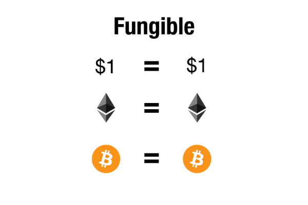
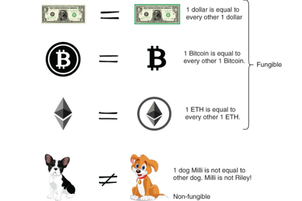
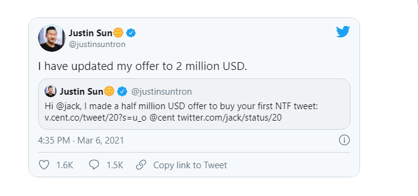

So you heard the term NFT huh, It's one of those things you hear about and think, Do I have any idea what’s going on in the world? Relax, you're not the only one.

## What is a Non-Fungible Token or NFT?

A non-fungible token “NFT” is a unique, individual token existing on a blockchain such as Ethereum. Unlike cryptocurrencies like bitcoin, each NFT token contains unique data. This non-fungible nature of the tokens means their use cases differ greatly from their fungible counterparts.

A one-of-a-kind trading card, is non-fungible. If you traded it for a different card, you’d have something completely different.

“Non-fungible” more or less means that it’s unique and can’t be replaced with something else. For example, a bitcoin is fungible — trade one for another bitcoin, and you’ll have exactly the same thing. but a 1976

now that you know what an NFT is, “not yet ? here: it's just a universally unique token that can not be counterfeited or duplicated. and everyone can check if it is Authentic. no experts needed ”.

## What can NFTs do?

“Non-fungible” is the reason for the rise of the NFT market! and all the hype around it. NFTs can really be anything Digital such as “drawings, music, videos, images, even Tweets are sold as NFT”, It is a proof of authenticity. YOU OWN THE ORIGINAL !

> ## Jack Dorsey is offering to sell the first tweet as an NFT and the highest bid is $2.5 million

Yes! you read that right, The Twitter CEO shared a link Friday afternoon to a platform called “Valuables,” where his March 21, 2006 tweet “just setting up my twttr” was up for bidding. The highest offer is from Sina Estavi, CEO of Bridge Oracle, for $2.5 million as of Saturday afternoon, according to the website. CNBC Article <a href="https://www.cnbc.com/2021/03/06/jack-dorsey-is-offering-to-sell-the-first-tweet-as-an-nft.html" target="_blank"> here </a>

Now you may wonder why someone would buy a tweet everyone else can just login and look it up. you can also print a Mona Lisa at home but it is not the original. so why would someone pay for it ? let's see

## What gives an NFT its value?

- <strong>Unique</strong>- Each NFT is unique, its the only one of its kind. You cannot make another NFT that is the same token number on the same smart contract. Meaning there will only ever be one of that token. This is verified by the blockchain and can be seen by anyone.
- <strong>Copyright </strong>- Your NFT might come with copyright if you are using Mintable.app. If the seller chooses to do so - it means that its on the blockchain that the owner of that token would have complete commercial copyright to use that image and asset.
- <strong>Rare </strong>-Since they are unique and cannot be copied, they are rare. Most of the time, there are very few NFTs from an artist or seller - very rarely do they have 1000s of NFTs. Therefore, you can safely assume you would be one of the few people in the world that owns an collectible item, that can be resold.

- <strong>Collectible </strong>- These NFTs/items are collectible. You can hold onto them, and their value will only go up in price since there are little ways to dilute the collection. Buying them to resell them can earn you thousands of dollars. There are plenty of people who do it everyday and earn a living from it.

- <strong>Downloadable </strong>- If on Mintable.app, only the current owner of the NFT can download the file attached to it. Making it unlockable to the owner. If your NFT has something like, game assets, music, a PDF, or more locked inside it, you might want to buy the NFT just to download that song/PDF/etc.

- <strong>Immutable </strong>-No one can change the metadata on the token, no one can remove your image, or the name of the token, etc. This means it will never change, it will never be removed, it cannot be taken down off the blockchain. This is what gives it so much value and collectibility.
- <strong>Forever </strong>-NFTs are forever. Because the data doesn't change, and because the blockchain is forever, you will always have that token if you buy it. You can always resell that token if you want. Its like buying a bar of gold - you own it, and you can do with it what you want.
- <strong>Resellable </strong>- You can always resell your NFT. You SHOULD resell your NFT and trade it. You can make some serious cash trading NFTs. Some NFTs have gone for 20,000 USD + when the original buyer only bought it for a few thousand dollars. Making them over 15,000 USD in a short time in ONE trade!

> ## NFTs are valuable

## Conclusion

I congratulate you if you are reading about NFTs at this time. this means you are aware of what is happening in the market. NFTs are here to stay ! and you should stay up to date if you want to have a share of the huge market rising up !

I kept this article brief just to clarify what a token is and what are NFTs. now i advise you to read this article :<a href="/NFT/Trading%20NFT/"> Why You Should Get Into NFTs</a>

if there is something you still have your doubts about. please leave it in a comment. i will answer it for you. or write a new article about it. Whatever is your level of comprehension at the moment. stay in NFTs. Do not turn away from this new gold rush !

<!-- https://academy.ivanontech.com/blog/definition-and-use-cases-of-non-fungible-tokens-nft -->
