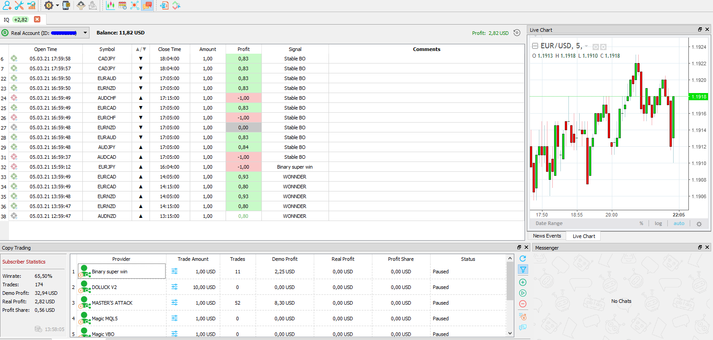
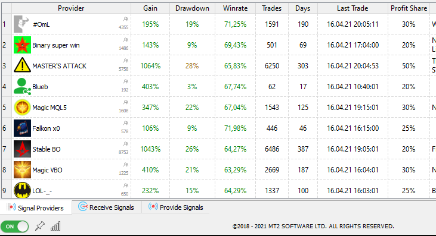

A good way to make money online is trading on the Forex Exchange Market. The global forex trading market is worth $1,934,500,000,000 (that's $1.93 quadrillion).

It is easy to start trading. You just open an account with your favorite Broker and start Buying/Selling stocks - currencies - commodities.

**But Will you make any profit out of it ?**

Around 70% of forex traders lose money and end up quitting.

Be it failure to manage risk. newbie greed. low start-up capital. or Refusing to Be Wrong. It is not easy to start making money trading forex. it is not easy predicting a stock. or reading a candlestick chart.

Today i will show you the beginners friendly strategy to making money trading Binary Options.

## What Is Copy Trading

Copy trading is a branch of [social trading](https://en.wikipedia.org/wiki/Social_trading)

Copy Trading enables individuals like you to **automatically copy** positions opened and managed by another selected trading expert. [-Wikipedia](https://en.wikipedia.org/wiki/Copy_trading)

In simpler words: Let the stock experts do the work for you in return of a small profit share.

Copy trading is available on all stocks ,commodities, and currencies.

but it thrives on Binary Options trading.

## What is a Binary Option

Binary options are simple to understand, making them a popular choice for low-skilled traders. and perfect for signal providers.

These options have a clearly stated expiration date, time, and strike price.

To make profit in a Binary Option. you have to correctly **predict price changes** and calculate the **time when** this will happen. if it's going down you  PUT . if the price is going up you  CALL.

If your are right. you will be paid a predetermined amount. if not. you will lose the money invested in the option.

## How to Start Copy Trading

> In this article i will be using the IQ Option broker.

1. Create a New Account At [IQ Option](https://affiliate.iqbroker.com/redir/?aff=243292).  
   It is free and have a demo account we will use to test the signal providers later.
2. Download the [MT2 Trading](https://www.mt2trading.com/?ref=1851) platform.  
   This can be used for free as long as you run on a Demo Account.
3. Login to your IQ Account through MT2 Platform.
   the MT2 supports many brokers. we use IQ for this article.

If you have done the previous steps correctly you should be Logged in to the MT2 Dashboard.

Next step is to subscribe to a signal provider. so we can Copy Trade whenever they open a position.

## Signal Providers

In the MT2 Platform. Go to View, Social Trading, and you will see a new Tab dedicated to copy trading. a list of all available robots (Provider) will show.

The statistics on this list are very important when subscribing to a Signal Provider.

- Do not copy new Bots. Should be at least 30 days old.  
   Take a look at the history of trades. which days are winning and which are losing.

  some bots tend to execute a limited number of trades on a specific time of the day.

- the WinRate should be high. consider also the number of all trades  
   a bot with 60% Winrate but only 30 trades does not reflect how good it is.

- Number of trades per day is also important. i do not like to copy bots with more than 40 trades per day. they are not consistent.

- Test for 2 weeks on the Demo Account. and trade with the same amount you would have put if it was the real account. so you can have a good understanding of the Funds and Starting Balance.

## Risk Management

This is something to learn along the way. any business should have a risk management plan.

MT2 settings provide us with enough parameters to manage our funds.

- **Minimum Payout**: i do not enter trades with less than 70% Payout. You can experience with it.

- **Stop Loss** : When Copy trading. you will always be away from computer. and just monitoring. Always Setup a Stop Loss Value.

- **Take Profit**: Take profit and stop trading when you reach a certain amount. is also a Risk Management.

## How Much You Pay and Profit.

When you are done playing with Demo accounts and decide to start making money.

**First**. You need to buy a license for the [MT2 Software](https://www.mt2trading.com/?ref=1851). i use the 1 year license. But they also have a 1 month plan.

**Second**. Deposit the amount you would like to start investing in your [IQ Option](https://affiliate.iqbroker.com/redir/?aff=243292) Real Account.

**Third** Signal providers take a share of your profit . ranging from 10% to 50%. this is calculated on the MT2 Platform. and paid monthly.

There is no limit to how much money you can make. but do not be fooled. this does not mean it is risk free. You could also lose all your money if you are not trading with trusted bots and have a good risk management setup.

## Conclusion

> **It Is Free to try, why don't you test it?**

As you can see on my new account created just for this tutorial. i have made a $32 USD in Demo Profit. then deposited 10$ on my IQ Real account and switched to it. i have made a 167USD Real profit with $34.97 USD to pay in share at the end of the month.

And April is not done yet.

Keep in mind that this is a newly set account. with trading amount between 1-2$/trade. on a Stop loss of $15. and Take Profit on $20;

And here is the IQ Option Balance History. To show you i deposited $10 and withdrawn $40. at the end of March to pay my invoice with.

> **MT2 Bots with IQ Binary Option Is a money making machine if done right. What is stopping you ? All you need is a Computer with internet**

> **Now the only question is: When are you starting ? Tell me in the comments**

<!-- <iframe width="1584" height="588" src="https://www.youtube.com/embed/_C-YG52TvUk" title="YouTube video player" frameborder="0" allow="accelerometer; autoplay; clipboard-write; encrypted-media; gyroscope; picture-in-picture" allowfullscreen></iframe> -->
<!--
"Trade Binary Options automatically based on your MetaTrader indicators, or copy world’s
